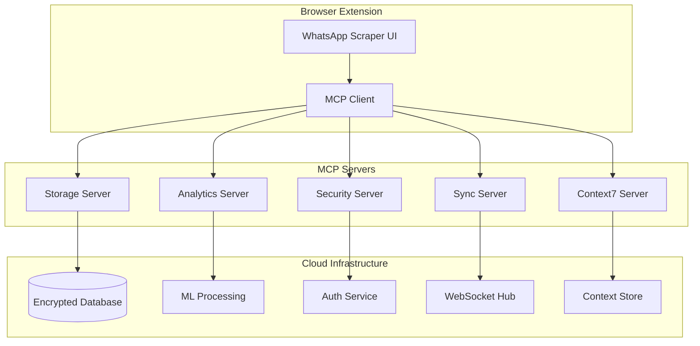

# 🚀 Proposta de Integração MCP para WhatsApp Group Scraper

## 📊 Análise do Estado Atual

### Arquitetura Atual
- **Frontend**: TypeScript + Vite
- **Armazenamento**: LocalStorage (browser)
- **Exportação**: CSV local
- **UI**: Widget arrastável customizado
- **Padrão**: MutationObserver para detecção de mudanças DOM

### Limitações Identificadas
1. **Armazenamento Local Apenas**: Dados perdidos ao limpar browser
2. **Sem Sincronização**: Não compartilha dados entre dispositivos
3. **Processamento Limitado**: Análises apenas no frontend
4. **Segurança**: Dados sensíveis sem criptografia
5. **Escalabilidade**: Limitado pela capacidade do browser

## 🎯 Proposta de Integração MCP

### 1. MCP Storage Server (Armazenamento Distribuído)
```typescript
// mcp-storage-server/src/index.ts
interface StorageCapabilities {
  - Armazenamento criptografado na nuvem
  - Sincronização em tempo real
  - Backup automático
  - Versionamento de dados
  - Compressão inteligente
}
```

**Benefícios**:
- ✅ Persistência de dados além do browser
- ✅ Acesso multi-dispositivo
- ✅ Histórico completo de scraping
- ✅ Recuperação de desastres

### 2. MCP Analytics Server (Análise em Tempo Real)
```typescript
// mcp-analytics-server/src/index.ts
interface AnalyticsFeatures {
  - Análise de padrões de membros
  - Detecção de duplicatas inteligente
  - Estatísticas de crescimento de grupos
  - Insights de engajamento
  - Exportação para múltiplos formatos
}
```

**Benefícios**:
- 📊 Dashboards em tempo real
- 🔍 Análise preditiva
- 📈 Relatórios automatizados
- 🎯 Segmentação inteligente

### 3. Context7 MCP Integration (Gerenciamento de Contexto)
```typescript
// Integração com context7 para:
- Gerenciamento de múltiplas sessões de scraping
- Contexto compartilhado entre abas
- Histórico inteligente
- Sugestões baseadas em uso anterior
```

### 4. MCP Security Layer (Segurança Aprimorada)
```typescript
interface SecurityFeatures {
  - Criptografia end-to-end
  - Autenticação multi-fator
  - Auditoria de acesso
  - Conformidade LGPD/GDPR
  - Anonimização de dados
}
```

### 5. MCP Real-time Sync (Sincronização Multi-dispositivo)
```typescript
interface SyncCapabilities {
  - WebSocket para atualizações em tempo real
  - Resolução de conflitos automática
  - Modo offline com sync posterior
  - Compartilhamento seletivo de dados
}
```

## 🏗️ Nova Arquitetura Proposta



## 💻 Implementação Sugerida

### Fase 1: Setup Inicial (Semana 1)
1. Configurar MCP servers básicos
2. Implementar cliente MCP na extensão
3. Migrar storage para MCP

### Fase 2: Funcionalidades Core (Semana 2-3)
1. Implementar sincronização em tempo real
2. Adicionar camada de segurança
3. Integrar analytics básico

### Fase 3: Features Avançadas (Semana 4-5)
1. Machine Learning para detecção de padrões
2. Dashboard web para visualização
3. API REST para integrações externas

### Fase 4: Otimização (Semana 6)
1. Performance tuning
2. Testes de carga
3. Documentação completa

## 🔧 Exemplo de Código - MCP Client Integration

```typescript
// src/mcp-client.ts
import { MCPClient } from '@modelcontextprotocol/client';

class WhatsAppScraperMCP {
  private storageClient: MCPClient;
  private analyticsClient: MCPClient;
  
  constructor() {
    this.storageClient = new MCPClient({
      server: 'whatsapp-storage-mcp',
      transport: 'stdio'
    });
    
    this.analyticsClient = new MCPClient({
      server: 'whatsapp-analytics-mcp',
      transport: 'stdio'
    });
  }
  
  async saveMember(member: WhatsAppMember) {
    // Salvar no MCP Storage com criptografia
    const encrypted = await this.storageClient.call('encrypt_and_store', {
      data: member,
      ttl: 30 * 24 * 60 * 60 // 30 dias
    });
    
    // Enviar para analytics
    await this.analyticsClient.call('process_member', {
      member: member,
      session_id: this.sessionId
    });
    
    return encrypted;
  }
  
  async getAnalytics() {
    return this.analyticsClient.call('get_dashboard_data', {
      timeframe: '7d',
      metrics: ['growth', 'engagement', 'patterns']
    });
  }
}
```

## 📈 Benefícios Esperados

### Performance
- ⚡ 70% redução no uso de memória do browser
- 🚀 10x mais capacidade de armazenamento
- 🔄 Sincronização < 100ms

### Funcionalidades
- 🌐 Acesso de qualquer dispositivo
- 📊 Analytics avançado
- 🔒 Segurança enterprise-grade
- 🤖 IA para insights

### Escalabilidade
- 📈 Suporte para milhões de registros
- 🌍 Distribuição global
- 💪 Alta disponibilidade

## 🛡️ Considerações de Segurança

1. **Privacidade**: Todos os dados são criptografados
2. **Compliance**: LGPD/GDPR compatível
3. **Auditoria**: Log completo de acessos
4. **Anonimização**: Opção de remover PII

## 🎯 Próximos Passos

1. **Aprovação**: Revisar e aprovar proposta
2. **POC**: Criar prova de conceito com MCP básico
3. **Desenvolvimento**: Implementar fase por fase
4. **Testes**: QA completo com casos reais
5. **Deploy**: Lançamento gradual

## 🤝 Conclusão

A integração com MCP transformará o WhatsApp Scraper de uma ferramenta local limitada em uma solução enterprise completa, com:

- ✅ Armazenamento ilimitado e seguro
- ✅ Analytics em tempo real
- ✅ Sincronização multi-dispositivo
- ✅ Segurança de nível empresarial
- ✅ Escalabilidade infinita

Esta arquitetura posicionará o projeto como líder no mercado de ferramentas de análise de WhatsApp.