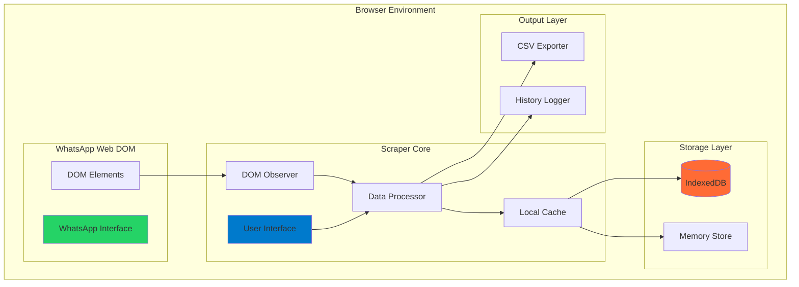

# 🏗️ Architecture - WhatsApp Group Scraper

## 📋 Índice do Cluster

| Documento | Descrição |
|-----------|-----------|
| [🎯 Visão Geral](./overview.md) | Arquitetura geral do sistema |
| [🏛️ Componentes](./components.md) | Estrutura de componentes e módulos |
| [🔍 Mecanismo de Scraping](./scraping-mechanism.md) | **Como funciona tecnicamente o scraping** |
| [🎯 Seletores DOM](./dom-selectors.md) | Seletores específicos do WhatsApp Web |
| [🏛️ Design do Sistema](./system-design.md) | Arquitetura detalhada e padrões |
| [🔄 Fluxo de Dados](./data-flow.md) | Como os dados fluem pelo sistema |
| [🎨 Padrões de Design](./design-patterns.md) | Patterns arquiteturais utilizados |
| [💾 Camada de Dados](./data-layer.md) | Storage, cache e persistência |

## 🎯 Arquitetura High-Level



## 🧩 Componentes Principais

### 🎮 Interface de Usuário
```typescript
interface UIComponents {
  widget: FloatingWidget;      // Widget principal flutuante
  controls: ControlButtons;    // Botões de controle
  feedback: ProgressDisplay;   // Indicadores de progresso
  history: ActivityLogger;     // Log de atividades
}
```

### 🔍 Sistema de Observação
```typescript
interface ObservationSystem {
  mutationObserver: MutationObserver;  // Monitora mudanças DOM
  elementSelector: ElementSelector;    // Seleciona elementos alvo
  dataExtractor: DataExtractor;        // Extrai dados dos elementos
  validator: DataValidator;            // Valida dados extraídos
}
```

### 💾 Camada de Persistência
```typescript
interface PersistenceLayer {
  indexedDB: IndexedDBStore;     // Armazenamento principal
  memoryCache: InMemoryCache;    // Cache rápido em memória
  sessionStorage: SessionStore;  // Dados de sessão
}
```

## 🔄 Fluxo Arquitetural

### 1. Inicialização
```javascript
graph LR
    A[Script Injection] --> B[DOM Ready Check]
    B --> C[UI Creation]
    C --> D[Observer Setup]
    D --> E[Cache Initialization]
```

### 2. Extração de Dados
```javascript
graph LR
    A[DOM Mutation] --> B[Element Detection]
    B --> C[Data Extraction]
    C --> D[Data Validation]
    D --> E[Cache Storage]
```

### 3. Exportação
```javascript
graph LR
    A[Export Request] --> B[Cache Retrieval]
    B --> C[Data Processing]
    C --> D[CSV Generation]
    D --> E[File Download]
```

## 🎨 Princípios Arquiteturais

### Single Responsibility
```typescript
// Cada classe tem uma responsabilidade específica
class DataExtractor {
  extract(element: HTMLElement): WhatsAppMember { }
}

class CSVExporter {
  export(data: WhatsAppMember[]): string { }
}

class StorageManager {
  store(data: WhatsAppMember): Promise<void> { }
}
```

### Dependency Injection
```typescript
// Dependências são injetadas, não hard-coded
class ScraperCore {
  constructor(
    private storage: IStorage,
    private extractor: IDataExtractor,
    private observer: IDOMObserver
  ) {}
}
```

### Observer Pattern
```typescript
// Sistema reativo baseado em observação
class DOMChangeObserver implements Observer {
  notify(mutation: MutationRecord): void {
    this.processChanges(mutation);
  }
}
```

## 📊 Métricas Arquiteturais

### Performance
- **Bundle Size**: ~150KB minificado
- **Memory Usage**: <5MB para 1000+ membros
- **Init Time**: <100ms
- **Response Time**: <50ms por membro

### Scalability
- **Max Members**: Testado até 5000+ membros
- **Concurrent Groups**: 1 por instância
- **Storage Limit**: ~50MB (quota browser)
- **Session Duration**: Ilimitado (com persistência)

## 🔧 Extensibilidade

### Plugin Architecture
```typescript
interface ScraperPlugin {
  name: string;
  version: string;
  init(): void;
  process(data: any): any;
  cleanup(): void;
}

class PluginManager {
  plugins: ScraperPlugin[] = [];
  
  register(plugin: ScraperPlugin): void { }
  execute(hook: string, data: any): any { }
}
```

### Configuration System
```typescript
interface ScraperConfig {
  ui: UIConfig;
  extraction: ExtractionConfig;
  storage: StorageConfig;
  export: ExportConfig;
}
```

## 🛡️ Considerações de Segurança

### Data Flow Security
- **Local Processing**: Todos os dados ficam no browser
- **No Network Calls**: Zero comunicação externa
- **Sandboxed Execution**: Isolado no contexto da página
- **User Consent**: Execução apenas com intervenção manual

### Error Boundaries
```typescript
class ErrorBoundary {
  handleError(error: Error, context: string): void {
    // Log error locally
    // Attempt graceful degradation
    // Preserve user data
    // Provide user feedback
  }
}
```

---

**Próximo**: Explore os documentos específicos para detalhes sobre [Componentes](./components.md), [Fluxo de Dados](./data-flow.md) ou outros aspectos arquiteturais.