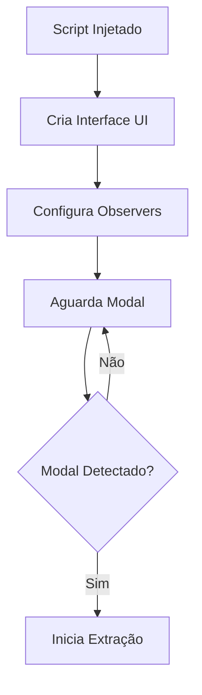
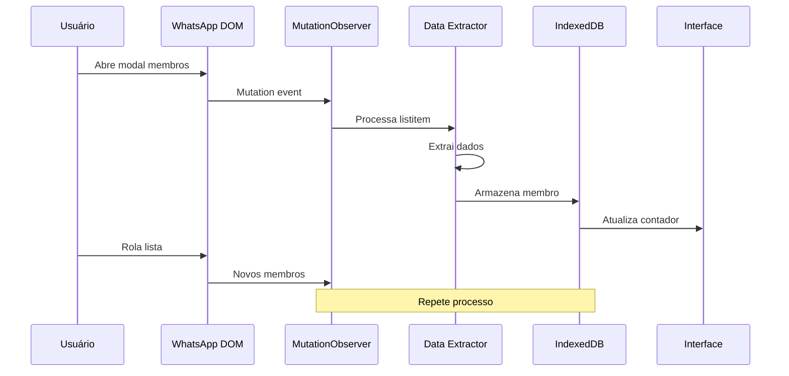

# 🔍 Mecanismo de Scraping - Como Funciona Tecnicamente

## 📋 Índice
- [Visão Geral](#visão-geral)
- [Arquitetura do Scraping](#arquitetura-do-scraping)
- [Processo Passo a Passo](#processo-passo-a-passo)
- [Componentes Técnicos](#componentes-técnicos)
- [Seletores DOM](#seletores-dom)
- [Fluxo de Dados](#fluxo-de-dados)
- [Otimizações e Performance](#otimizações-e-performance)

## 🎯 Visão Geral

O WhatsApp Group Scraper utiliza **MutationObserver API** para monitorar mudanças no DOM do WhatsApp Web em tempo real, extraindo informações de membros conforme são renderizados na interface.

### 🧩 Tecnologias Principais
- **MutationObserver** - Detecta mudanças DOM
- **QuerySelectors** - Localiza elementos específicos
- **IndexedDB** - Armazenamento persistente
- **Event Delegation** - Gerenciamento eficiente de eventos

## 🏗️ Arquitetura do Scraping

### 1. Sistema de Observação em Duas Camadas

```typescript
// CAMADA 1: Observer Principal (Detecta Modal)
const bodyObserver = new MutationObserver((mutations) => {
    // Monitora #app para detectar quando modal aparece
    // Procura por elementos com [data-animate-modal-body="true"]
});

// CAMADA 2: Observer do Modal (Extrai Dados)
const modalObserver = new MutationObserver((mutations) => {
    // Monitora mudanças dentro do modal
    // Extrai dados quando role="listitem" muda
});
```

### 2. Detecção de Elementos

O sistema identifica elementos específicos do WhatsApp Web:

```javascript
// Seletores principais utilizados
const SELECTORS = {
    // Modal de membros
    MODAL: '[data-animate-modal-body="true"]',
    MODAL_CONTENT: "div[style*='height']",
    
    // Item de membro individual
    LIST_ITEM: 'div[role="listitem"]',
    
    // Dados do membro
    NAME: 'span[title]:not(.copyable-text)',
    PHONE: 'span[style*="height"]:not([title])',
    DESCRIPTION: 'span[title].copyable-text',
    
    // Contexto do grupo
    GROUP_NAME: 'header span[style*="height"]:not(.copyable-text)'
};
```

## 📊 Processo Passo a Passo

### Fase 1: Inicialização



### Fase 2: Detecção do Modal

```typescript
function detectModal(mutations: MutationRecord[]) {
    for (const mutation of mutations) {
        if (mutation.type === "childList") {
            // Verifica se modal foi adicionado
            mutation.addedNodes.forEach((node) => {
                const modalElems = node.querySelectorAll('[data-animate-modal-body="true"]');
                if (modalElems.length > 0) {
                    // Modal encontrado! Inicia observação interna
                    listenModalChanges();
                }
            });
        }
    }
}
```

### Fase 3: Extração de Dados

```typescript
function extractMemberData(listItem: HTMLElement) {
    // 1. EXTRAI NOME
    const nameElem = listItem.querySelector('span[title]:not(.copyable-text)');
    const name = nameElem?.textContent?.trim().replace('~ ', '');
    
    // 2. EXTRAI TELEFONE
    const phoneElem = listItem.querySelector('span[style*="height"]:not([title])');
    const phone = phoneElem?.textContent?.trim();
    
    // 3. EXTRAI DESCRIÇÃO
    const descElem = listItem.querySelector('span[title].copyable-text');
    const description = cleanDescription(descElem?.textContent);
    
    // 4. IDENTIFICA FONTE (GRUPO)
    const groupElem = document.querySelector('header span[style*="height"]:not(.copyable-text)');
    const source = groupElem?.textContent;
    
    return { name, phone, description, source };
}
```

## 🔧 Componentes Técnicos

### 1. MutationObserver - O Coração do Sistema

```typescript
// Configuração do Observer
const observerConfig: MutationObserverInit = {
    attributes: true,      // Monitora mudanças de atributos
    childList: true,       // Monitora adição/remoção de elementos
    subtree: true          // Monitora toda a subárvore
};

// Callback do Observer
function handleMutations(mutations: MutationRecord[]) {
    mutations.forEach(mutation => {
        if (mutation.type === "attributes") {
            // Mudança de atributo - verifica se é listitem
            const target = mutation.target as HTMLElement;
            if (target.getAttribute("role") === "listitem") {
                // Novo membro renderizado!
                processListItem(target);
            }
        }
    });
}
```

### 2. Processamento Assíncrono

```typescript
// Usa setTimeout para aguardar renderização completa
window.setTimeout(async () => {
    // DOM está estável, extrai dados
    const memberData = extractMemberData(listItem);
    
    // Armazena no cache
    await memberListStore.addElem(
        memberData.profileId, 
        memberData,
        true // Permite atualização
    );
    
    // Atualiza UI
    updateCounter();
}, 10); // 10ms delay para garantir renderização
```

### 3. Deduplicação Inteligente

```typescript
// Usa profileId único (telefone ou nome)
const identifier = profilePhone || profileName;

// addElem verifica duplicatas internamente
await memberListStore.addElem(identifier, {
    profileId: identifier,
    name: profileName,
    phoneNumber: profilePhone,
    description: profileDescription,
    source: groupSource
}, true); // true = atualiza se existir
```

## 🎯 Seletores DOM Específicos

### Estrutura DOM do WhatsApp Web

```html
<!-- Modal de Membros -->
<div data-animate-modal-body="true">
    <div style="height: ...">
        <!-- Lista de Membros -->
        <div role="listitem">
            <!-- Nome -->
            <span title="João Silva">João Silva</span>
            
            <!-- Telefone -->
            <span style="height: 21px">+55 11 99999-9999</span>
            
            <!-- Descrição (Status) -->
            <span title="Desenvolvedor" class="copyable-text">
                Desenvolvedor
            </span>
        </div>
    </div>
</div>
```

### Estratégia de Seleção

1. **Seletores Específicos** - Evita conflitos
   ```javascript
   // ❌ Ruim - muito genérico
   document.querySelector('span')
   
   // ✅ Bom - específico
   listItem.querySelector('span[title]:not(.copyable-text)')
   ```

2. **Fallbacks e Validação**
   ```javascript
   const text = element?.textContent?.trim();
   if (text && text.length > 0) {
       // Processa apenas se válido
   }
   ```

3. **Filtros de Conteúdo**
   ```javascript
   // Filtra mensagens do sistema
   if (!text.match(/Loading About|I am using WhatsApp|Available/i)) {
       return text;
   }
   ```

## 🔄 Fluxo de Dados



## ⚡ Otimizações e Performance

### 1. Debouncing com setTimeout

```typescript
// Evita processamento excessivo
setTimeout(() => {
    processListItem(element);
}, 10); // Agrupa mudanças rápidas
```

### 2. Cache em Memória

```typescript
class WhatsAppStorage extends ListStorage {
    // ListStorage mantém cache Map() em memória
    // IndexedDB é usado apenas para persistência
    private memoryCache = new Map<string, WhatsAppMember>();
}
```

### 3. Processamento Seletivo

```typescript
// Processa apenas elementos novos/modificados
if (mutation.type === "attributes" && 
    target.getAttribute("role") === "listitem") {
    // Processa apenas listitems
}
```

### 4. Validação Early Exit

```typescript
// Sai cedo se dados inválidos
if (profileName.length === 0) {
    return; // Não processa membro sem nome
}
```

## 🎨 Versão Seletiva - Diferenças

### 1. Seleção Automática de Grupos

```typescript
// Lista grupos disponíveis
const groups = document.querySelectorAll('[role="listitem"] [data-testid="cell-frame-container"]');

// Clica no grupo selecionado
for (const group of groups) {
    const nameElem = group.querySelector('span[title]');
    if (nameElem?.textContent === selectedGroup) {
        (group as HTMLElement).click();
        break;
    }
}
```

### 2. Controle de Estado

```typescript
// Controla se extração está ativa
let isScrapingActive = false;

const callback = (mutations) => {
    if (!isScrapingActive) return; // Ignora se pausado
    // ... processa mutations
};
```

### 3. Auto-abertura do Modal

```typescript
function openMembersModal() {
    // Clica no header do grupo
    const groupHeader = document.querySelector('header [data-testid="conversation-info-header"]');
    groupHeader?.click();
    
    setTimeout(() => {
        // Procura e clica em "Ver todos"
        const viewAllLinks = document.querySelectorAll('span[role="button"]');
        for (const link of viewAllLinks) {
            if (link.textContent?.match(/View all|Ver todos/i)) {
                link.click();
                break;
            }
        }
    }, 500);
}
```

## 🚨 Considerações Técnicas

### 1. Dependência da Estrutura DOM
- WhatsApp pode mudar seletores sem aviso
- Código deve ser atualizado quando DOM muda
- Recomenda-se testes regulares

### 2. Performance com Grupos Grandes
- MutationObserver pode ficar lento com muitas mudanças
- Scroll muito rápido pode perder membros
- Recomenda-se scroll gradual

### 3. Limitações do Browser
- IndexedDB tem quota limitada (~50MB típico)
- Muitos observers podem impactar performance
- Memory leaks se observers não forem desconectados

### 4. Rate Limiting Natural
- Scroll manual cria delay natural
- Evita detecção como bot
- Simula comportamento humano

## 📊 Métricas de Performance

```typescript
// Taxa típica de extração
const metrics = {
    extractionRate: '~50 membros/minuto',
    memoryUsage: '<5MB para 1000 membros',
    cpuUsage: 'Baixo - event-driven',
    accuracy: '>99% com scroll adequado'
};
```

## 🔮 Conclusão

O mecanismo de scraping é **elegante e eficiente**, utilizando APIs nativas do browser para monitorar mudanças DOM em tempo real. A abordagem event-driven minimiza uso de recursos enquanto maximiza precisão da extração.

**Pontos Fortes:**
- ✅ Zero polling - totalmente baseado em eventos
- ✅ Deduplicação automática
- ✅ Persistência robusta
- ✅ Simula comportamento humano

**Limitações:**
- ⚠️ Dependente da estrutura DOM do WhatsApp
- ⚠️ Requer interação manual (scroll)
- ⚠️ Limitado ao que é visível na tela