# 🏛️ Design do Sistema - WhatsApp Group Scraper

## 🎯 Visão Arquitetural

### Arquitetura em Camadas

```mermaid
graph TB
    subgraph "Camada de Apresentação"
        UI[Interface Flutuante]
        CTRL[Controles do Usuário]
        FEED[Feedback Visual]
    end
    
    subgraph "Camada de Negócio"
        CORE[Scraper Core]
        PROC[Data Processor]
        VALID[Data Validator]
        FILTER[Data Filters]
    end
    
    subgraph "Camada de Serviços"
        OBS[DOM Observer]
        EXTRACT[Data Extractor]
        EXPORT[Export Service]
        LOG[Logging Service]
    end
    
    subgraph "Camada de Dados"
        CACHE[Memory Cache]
        IDB[(IndexedDB)]
        SESSION[Session Storage]
    end
    
    subgraph "Camada Externa"
        DOM[WhatsApp DOM] 
        FILE[File System]
    end
    
    UI --> CORE
    CTRL --> CORE
    CORE --> PROC
    PROC --> VALID
    VALID --> FILTER
    CORE --> OBS
    OBS --> EXTRACT
    EXTRACT --> CACHE
    CACHE --> IDB
    PROC --> EXPORT
    EXPORT --> FILE
    CORE --> LOG
    OBS --> DOM
    
    classDef presentation fill:#e1f5fe
    classDef business fill:#f3e5f5
    classDef service fill:#e8f5e8
    classDef data fill:#fff3e0
    classDef external fill:#fce4ec
    
    class UI,CTRL,FEED presentation
    class CORE,PROC,VALID,FILTER business
    class OBS,EXTRACT,EXPORT,LOG service
    class CACHE,IDB,SESSION data
    class DOM,FILE external
```



## 🧩 Arquitetura de Componentes

### Core System
```typescript
// Sistema principal - coordena todos os componentes
class WhatsAppScraper {
  private ui: UIContainer;
  private observer: DOMObserver;
  private storage: StorageManager;
  private exporter: DataExporter;
  
  constructor() {
    this.initializeComponents();
    this.setupEventHandlers();
    this.startObservation();
  }
  
  private initializeComponents(): void {
    this.ui = new UIContainer();
    this.observer = new DOMObserver();
    this.storage = new StorageManager();
    this.exporter = new DataExporter();
  }
}
```

### Observer Pattern Implementation
```typescript
// Padrão Observer para mudanças DOM
interface DOMChangeListener {
  onMemberAdded(member: WhatsAppMember): void;
  onMemberUpdated(member: WhatsAppMember): void;
  onModalOpened(): void;
  onModalClosed(): void;
}

class DOMObserver {
  private listeners: DOMChangeListener[] = [];
  private mutationObserver: MutationObserver;
  
  addListener(listener: DOMChangeListener): void {
    this.listeners.push(listener);
  }
  
  private notifyListeners(event: string, data?: any): void {
    this.listeners.forEach(listener => {
      switch(event) {
        case 'memberAdded':
          listener.onMemberAdded(data);
          break;
        // ... other events
      }
    });
  }
}
```

## 🔄 Padrões de Design Utilizados

### 1. Observer Pattern
**Uso**: Monitoramento de mudanças DOM
```typescript
class MutationObserverWrapper implements Observer {
  private observers: Observer[] = [];
  
  subscribe(observer: Observer): void {
    this.observers.push(observer);
  }
  
  notify(data: MutationRecord[]): void {
    this.observers.forEach(obs => obs.update(data));
  }
}
```

### 2. Strategy Pattern
**Uso**: Diferentes estratégias de extração
```typescript
interface ExtractionStrategy {
  extract(element: HTMLElement): WhatsAppMember | null;
}

class BasicExtractionStrategy implements ExtractionStrategy {
  extract(element: HTMLElement): WhatsAppMember | null {
    // Implementação básica
  }
}

class SelectiveExtractionStrategy implements ExtractionStrategy {
  extract(element: HTMLElement): WhatsAppMember | null {
    // Implementação seletiva
  }
}
```

### 3. Factory Pattern
**Uso**: Criação de diferentes tipos de storage
```typescript
abstract class StorageFactory {
  static createStorage(type: 'indexed' | 'memory' | 'session'): IStorage {
    switch(type) {
      case 'indexed':
        return new IndexedDBStorage();
      case 'memory':
        return new MemoryStorage();
      case 'session':
        return new SessionStorage();
      default:
        throw new Error('Unknown storage type');
    }
  }
}
```

### 4. Command Pattern
**Uso**: Operações de UI
```typescript
interface Command {
  execute(): void;
  undo?(): void;
}

class ExportCommand implements Command {
  constructor(private exporter: DataExporter) {}
  
  execute(): void {
    this.exporter.exportToCSV();
  }
}

class ResetCommand implements Command {
  constructor(private storage: StorageManager) {}
  
  execute(): void {
    this.storage.clear();
  }
}
```

## 💾 Arquitetura de Dados

### Data Flow Architecture


### Storage Layer Design
```typescript
// Camada de abstração para diferentes tipos de storage
interface IStorage {
  store(key: string, data: any): Promise<void>;
  retrieve(key: string): Promise<any>;
  delete(key: string): Promise<void>;
  clear(): Promise<void>;
  count(): Promise<number>;
}

// Implementação híbrida com cache em memória + persistência
class HybridStorage implements IStorage {
  private memoryCache = new Map<string, any>();
  private persistentStorage: IndexedDBStorage;
  
  async store(key: string, data: any): Promise<void> {
    // Armazena em memória para acesso rápido
    this.memoryCache.set(key, data);
    
    // Persiste em IndexedDB para durabilidade
    await this.persistentStorage.store(key, data);
  }
}
```

## 🎨 Padrões de UI/UX

### Component-Based UI
```typescript
// Componentes reutilizáveis de UI
abstract class UIComponent {
  protected element: HTMLElement;
  protected parent: HTMLElement;
  
  abstract render(): HTMLElement;
  abstract destroy(): void;
  
  protected createElement(tag: string, className?: string): HTMLElement {
    const element = document.createElement(tag);
    if (className) element.className = className;
    return element;
  }
}

class FloatingWidget extends UIComponent {
  private buttons: Button[] = [];
  private dragHandler: DragHandler;
  
  render(): HTMLElement {
    this.element = this.createElement('div', 'scraper-widget');
    this.setupDragHandling();
    this.renderButtons();
    return this.element;
  }
}
```

### State Management
```typescript
// Gerenciamento de estado simples e reativo
class ScraperState {
  private state: {
    isActive: boolean;
    memberCount: number;
    selectedGroup?: string;
    isExporting: boolean;
  } = {
    isActive: false,
    memberCount: 0,
    isExporting: false
  };
  
  private listeners: ((state: any) => void)[] = [];
  
  setState(updates: Partial<typeof this.state>): void {
    this.state = { ...this.state, ...updates };
    this.notifyListeners();
  }
  
  private notifyListeners(): void {
    this.listeners.forEach(listener => listener(this.state));
  }
}
```

## 🔧 Arquitetura de Extensibilidade

### Plugin System
```typescript
// Sistema de plugins para extensibilidade
interface Plugin {
  name: string;
  version: string;
  init(scraper: WhatsAppScraper): void;
  destroy(): void;
}

class PluginManager {
  private plugins = new Map<string, Plugin>();
  
  register(plugin: Plugin): void {
    this.plugins.set(plugin.name, plugin);
    plugin.init(this.scraper);
  }
  
  unregister(pluginName: string): void {
    const plugin = this.plugins.get(pluginName);
    if (plugin) {
      plugin.destroy();
      this.plugins.delete(pluginName);
    }
  }
}

// Exemplo de plugin
class AdvancedFiltersPlugin implements Plugin {
  name = 'advanced-filters';
  version = '1.0.0';
  
  init(scraper: WhatsAppScraper): void {
    // Adiciona filtros avançados ao scraper
  }
  
  destroy(): void {
    // Cleanup
  }
}
```

### Event System
```typescript
// Sistema de eventos para comunicação entre componentes
class EventBus {
  private events = new Map<string, Function[]>();
  
  on(event: string, callback: Function): void {
    if (!this.events.has(event)) {
      this.events.set(event, []);
    }
    this.events.get(event)!.push(callback);
  }
  
  emit(event: string, data?: any): void {
    const callbacks = this.events.get(event);
    if (callbacks) {
      callbacks.forEach(callback => callback(data));
    }
  }
  
  off(event: string, callback: Function): void {
    const callbacks = this.events.get(event);
    if (callbacks) {
      const index = callbacks.indexOf(callback);
      if (index > -1) {
        callbacks.splice(index, 1);
      }
    }
  }
}
```

## 🚦 Error Handling Architecture

### Error Boundaries
```typescript
// Sistema de tratamento de erros em camadas
class ErrorHandler {
  private static instance: ErrorHandler;
  private errorBoundaries = new Map<string, ErrorBoundary>();
  
  static getInstance(): ErrorHandler {
    if (!ErrorHandler.instance) {
      ErrorHandler.instance = new ErrorHandler();
    }
    return ErrorHandler.instance;
  }
  
  handleError(error: Error, context: string): void {
    const boundary = this.errorBoundaries.get(context);
    if (boundary) {
      boundary.handle(error);
    } else {
      this.globalErrorHandler(error, context);
    }
  }
  
  private globalErrorHandler(error: Error, context: string): void {
    console.error(`Error in ${context}:`, error);
    
    // Attempt graceful degradation
    this.attemptRecovery(context);
    
    // Notify user if necessary
    this.notifyUser(error, context);
  }
}

interface ErrorBoundary {
  handle(error: Error): void;
}

class DOMObserverErrorBoundary implements ErrorBoundary {
  handle(error: Error): void {
    // Specific handling for DOM observer errors
    console.warn('DOM Observer error, attempting reconnection:', error);
    this.reconnectObserver();
  }
  
  private reconnectObserver(): void {
    // Reconecta o observer após erro
  }
}
```

## 📊 Performance Architecture

### Optimization Strategies
```typescript
// Estratégias de otimização implementadas
class PerformanceOptimizer {
  // Debounce para evitar processamento excessivo
  private debounce<T extends (...args: any[]) => any>(
    func: T,
    wait: number
  ): T {
    let timeout: NodeJS.Timeout;
    return ((...args: any[]) => {
      clearTimeout(timeout);
      timeout = setTimeout(() => func.apply(this, args), wait);
    }) as T;
  }
  
  // Throttle para limitar frequência de operações
  private throttle<T extends (...args: any[]) => any>(
    func: T,
    limit: number
  ): T {
    let inThrottle: boolean;
    return ((...args: any[]) => {
      if (!inThrottle) {
        func.apply(this, args);
        inThrottle = true;
        setTimeout(() => inThrottle = false, limit);
      }
    }) as T;
  }
  
  // Lazy loading para componentes pesados
  private lazyLoad<T>(factory: () => T): () => T {
    let instance: T;
    return () => {
      if (!instance) {
        instance = factory();
      }
      return instance;
    };
  }
}
```

### Memory Management
```typescript
// Gerenciamento de memória e limpeza
class MemoryManager {
  private observers: MutationObserver[] = [];
  private timers: NodeJS.Timeout[] = [];
  private eventListeners: (() => void)[] = [];
  
  addObserver(observer: MutationObserver): void {
    this.observers.push(observer);
  }
  
  addTimer(timer: NodeJS.Timeout): void {
    this.timers.push(timer);
  }
  
  addEventListener(cleanup: () => void): void {
    this.eventListeners.push(cleanup);
  }
  
  cleanup(): void {
    // Desconecta observers
    this.observers.forEach(obs => obs.disconnect());
    this.observers = [];
    
    // Limpa timers
    this.timers.forEach(timer => clearTimeout(timer));
    this.timers = [];
    
    // Remove event listeners
    this.eventListeners.forEach(cleanup => cleanup());
    this.eventListeners = [];
  }
}
```

---

**Próximo**: Explore os [Componentes](./components.md) específicos ou o [Fluxo de Dados](./data-flow.md) para entender melhor a implementação.