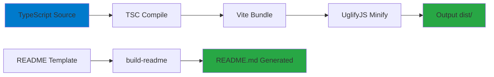

# 🔧 Development - WhatsApp Group Scraper

## 📋 Índice do Cluster

| Documento | Descrição |
|-----------|-----------|
| [⚙️ Setup](./setup.md) | Configuração do ambiente de desenvolvimento |
| [🏗️ Build](./build-process.md) | Processo de build e minificação |
| [🧪 Testes](./testing.md) | Estratégias e ferramentas de teste |
| [🤝 Contribuição](./contributing.md) | Como contribuir com o projeto |

## 🚀 Quick Start

### Pré-requisitos
```bash
# Node.js 18+ e Yarn
node --version  # v18+
yarn --version  # v1.22+
```

### Setup Inicial
```bash
# Clone o repositório
git clone <repo-url>
cd whatsapp-group

# Instale dependências  
yarn install

# Build do projeto
yarn build

# Teste local
yarn test
```

## 🏗️ Estrutura do Projeto

```
whatsapp-group/
├── src/                    # Código fonte
│   ├── main.ts            # Versão básica
│   └── main-selective.ts  # Versão seletiva
├── dist/                  # Build output
│   ├── main.min.js       # Versão básica minificada
│   └── main-selective.min.js # Versão seletiva minificada
├── docs/                  # Documentação (clusters)
├── node_modules/          # Dependências
├── package.json          # Configuração NPM
├── tsconfig.json         # Configuração TypeScript
├── vite.config.ts        # Configuração Vite
└── test-puppeteer.js     # Testes automatizados
```

## 🛠️ Scripts Disponíveis

### Build Scripts
```json
{
  "build-vite": "tsc && vite build",
  "build": "yarn build-vite && yarn minify && build-readme README.md", 
  "build-selective": "tsc src/main-selective.ts --outDir dist --module esnext --target es2020 && uglifyjs dist/main-selective.js --compress --mangle --output dist/main-selective.min.js",
  "minify": "uglifyjs --compress --mangle --output dist/main.min.js -- dist/main.mjs"
}
```

### Test Scripts  
```json
{
  "test": "node test-puppeteer.js",
  "test-auto": "node test-puppeteer.js --auto",
  "test:brave": "node test-brave-browser.js",
  "test:brave:check": "node test-brave-browser.js --check"
}
```

## 🔧 Configuração de Desenvolvimento

### TypeScript Config
```json
{
  "compilerOptions": {
    "target": "ES2020",
    "module": "ESNext", 
    "lib": ["ES2020", "DOM", "DOM.Iterable"],
    "strict": true,
    "moduleResolution": "bundler",
    "allowImportingTsExtensions": true,
    "noEmit": true
  }
}
```

### Vite Config
```typescript
export default defineConfig({
  optimizeDeps: {
    include: ['browser-scraping-utils'],
  },
  build: {
    lib: {
      formats: ['es'],
      entry: resolve(__dirname, '/src/main.ts'),
      name: 'fb-group-scraper',
      fileName: 'main',
    },
    minify: false
  }
})
```

## 📦 Dependências

### Production
```json
{
  "@ikerin/build-readme": "^1.1.1",
  "browser-scraping-utils": "git+https://github.com/floriandiud/browser-scraping-utils#0.2.0",
  "typescript": "5",
  "uglify-js": "^3.15.1",
  "vite": "^5.0.12",
  "vite-tsconfig-paths": "^4.3.1"
}
```

### Development
```json
{
  "@types/node": "^20.11.7",
  "puppeteer": "^24.14.0"
}
```

## 🧪 Estratégia de Testes

### Testes Automatizados
```javascript
// test-puppeteer.js - Testes com navegador real
const puppeteer = require('puppeteer');

async function testWhatsAppScraper() {
  const browser = await puppeteer.launch({
    headless: false,
    defaultViewport: { width: 1280, height: 720 }
  });
  
  const page = await browser.newPage();
  
  // Navega para WhatsApp Web
  await page.goto('https://web.whatsapp.com');
  
  // Injeta script
  await page.evaluate(scraperScript);
  
  // Verifica se interface apareceu
  const interfaceVisible = await page.evaluate(() => {
    return document.querySelector('.scraper-widget') !== null;
  });
  
  console.log('Interface detectada:', interfaceVisible);
}
```

### Testes Manuais
```javascript
// Helpers para debug no console
window.scraperDebug = {
  getCache: () => memberListStore.getAll(),
  clearCache: () => memberListStore.clear(),
  getStats: () => ({ 
    members: memberListStore.size,
    uptime: Date.now() - startTime
  })
};
```

## 🔄 Workflow de Desenvolvimento

### Feature Development
```bash
# 1. Crie branch para feature
git checkout -b feature/nome-da-feature

# 2. Desenvolva com hot reload
yarn dev  # se disponível, ou build + test

# 3. Teste localmente
yarn test

# 4. Build final
yarn build

# 5. Teste build
yarn test

# 6. Commit e push
git add .
git commit -m "feat: descrição da feature"
git push origin feature/nome-da-feature
```

### Bug Fixes
```bash
# 1. Reproduza o bug
yarn test --scenario=bug-scenario

# 2. Implemente fix  
# Edite código fonte

# 3. Verifique fix
yarn test

# 4. Regressão
yarn test --full

# 5. Deploy
yarn build
```

## 🏗️ Arquitetura de Build

### Build Pipeline


### Output Structure
```
dist/
├── main.mjs              # Vite output (ES modules)
├── main.min.js          # Minified basic version
├── main-selective.js    # Compiled selective version
└── main-selective.min.js # Minified selective version
```

## 🤝 Contribution Guidelines

### Code Style
```typescript
// Use TypeScript strict mode
interface Member {
  profileId: string;  // Required fields
  name?: string;      // Optional with ?
}

// Document public functions
/**
 * Extracts member data from DOM element
 * @param element - HTML element containing member data
 * @returns Member data or null if invalid
 */
function extractMemberData(element: HTMLElement): WhatsAppMember | null {
  // Implementation
}
```

### Commit Convention
```bash
# Format: type(scope): description
feat(ui): add drag and drop functionality
fix(storage): resolve IndexedDB connection issue  
docs(api): update interface documentation
test(puppeteer): add browser compatibility tests
```

### Pull Request Process
1. **Fork** o repositório
2. **Create** feature branch
3. **Implement** changes com testes
4. **Update** documentação se necessário
5. **Submit** PR com descrição clara
6. **Address** feedback do review

## 🔍 Debug e Troubleshooting

### Debug Mode
```javascript
// Ativa logs detalhados
window.scraperDebug = true;

// Console helpers
console.log('Cache contents:', await memberListStore.getAll());
console.log('Current stats:', scraperStats);
```

### Common Issues
```javascript
// Issue: MutationObserver não conecta
// Solution: Check target element exists
const target = document.querySelector('#app');
if (!target) {
  console.error('Target element not found');
}

// Issue: IndexedDB quota exceeded  
// Solution: Clear old data
await memberListStore.clear();
```

## 📊 Performance Monitoring

### Metrics Collection
```typescript
interface PerformanceMetrics {
  extractionRate: number;    // members/minute
  memoryUsage: number;       // MB
  errorRate: number;         // percentage
  cacheHitRate: number;      // percentage
}

// Monitor during development
const metrics = {
  startTime: Date.now(),
  membersProcessed: 0,
  errorsCount: 0
};
```

---

**Próximo**: Consulte o [Setup](./setup.md) detalhado ou veja como [Contribuir](./contributing.md) com o projeto.