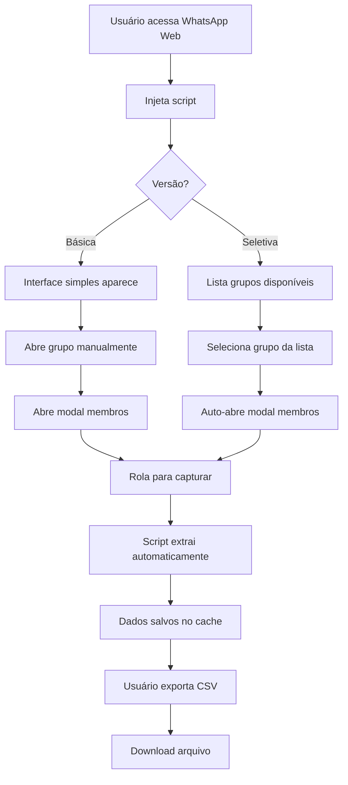

# ✨ Features - WhatsApp Group Scraper

## 📋 Índice do Cluster

| Documento | Descrição |
|-----------|-----------|
| [📖 Guia de Uso](./usage-guide.md) | Como usar as funcionalidades principais |
| [🎯 Versão Básica](./basic-scraper.md) | Funcionalidades da versão main.ts |
| [⚡ Versão Seletiva](./selective-scraper.md) | Funcionalidades da versão main-selective.ts |
| [🔄 Comparação](./version-comparison.md) | Diferenças entre as versões |
| [🧪 Casos de Uso](./use-cases.md) | Exemplos práticos de aplicação |

## 🚀 Funcionalidades Principais

### ⚡ Extração Automatizada
- **Observação DOM em tempo real** - Detecta novos membros automaticamente
- **Scroll-based collection** - Coleta dados conforme usuário navega
- **Batch processing** - Processa múltiplos membros simultaneamente
- **Auto-deduplication** - Remove duplicatas automaticamente

### 🎮 Interface Intuitiva
- **Widget flutuante** - Controles não-intrusivos
- **Drag & drop** - Reposiciona interface facilmente
- **Feedback visual** - Indicadores de progresso em tempo real
- **Histórico de atividades** - Log detalhado das operações

### 💾 Persistência Inteligente
- **Cache local** - Dados salvos no IndexedDB
- **Cross-session** - Mantém dados entre sessões
- **Auto-recovery** - Recupera dados após crashes
- **Export incremental** - Exporta apenas novos dados

### 📊 Exportação Flexível
- **Formato CSV** - Compatível com Excel/Google Sheets
- **Headers customizáveis** - Campos configuráveis
- **Source tagging** - Identifica origem dos dados
- **Batch export** - Exporta múltiplos grupos

## 🎯 Versões Disponíveis

### 📦 Versão Básica (`main.ts`)
```javascript
// Uso geral - funciona com qualquer grupo
✅ Interface simples
✅ Extração manual
✅ Export CSV básico
✅ Cache persistente
```

### 🎯 Versão Seletiva (`main-selective.ts`)
```javascript
// Grupos específicos com controles avançados
✅ Seletor de grupos
✅ Extração direcionada
✅ Auto-open groups
✅ Tagged exports
✅ Controles start/stop
```

## 🔄 Fluxo de Funcionalidades



## 🎨 Funcionalidades por Categoria

### 🖥️ Interface do Usuário
| Funcionalidade | Básica | Seletiva | Descrição |
|----------------|---------|----------|-----------|
| Widget flutuante | ✅ | ✅ | Interface não-intrusiva |
| Drag & drop | ✅ | ✅ | Reposiciona controles |
| Contador visual | ✅ | ✅ | Mostra total extraído |
| Histórico logs | ✅ | ✅ | Log de atividades |
| Seletor grupos | ❌ | ✅ | Escolhe grupo específico |
| Controle start/stop | ❌ | ✅ | Liga/desliga extração |

### 🔍 Extração de Dados
| Funcionalidade | Básica | Seletiva | Descrição |
|----------------|---------|----------|-----------|
| Extração em tempo real | ✅ | ✅ | Coleta conforme aparece |
| Auto-deduplication | ✅ | ✅ | Remove duplicatas |
| Data validation | ✅ | ✅ | Valida dados extraídos |
| Source tagging | ✅ | ✅ | Identifica origem |
| Group selection | Manual | Auto | Como seleciona grupos |
| Modal auto-open | ❌ | ✅ | Abre modal automaticamente |

### 💾 Armazenamento
| Funcionalidade | Básica | Seletiva | Descrição |
|----------------|---------|----------|-----------|
| IndexedDB cache | ✅ | ✅ | Persistência local |
| Memory cache | ✅ | ✅ | Acesso rápido |
| Cross-session | ✅ | ✅ | Dados entre sessões |
| Auto-backup | ✅ | ✅ | Backup automático |
| Group isolation | ✅ | ✅ | Dados por grupo |

### 📤 Exportação
| Funcionalidade | Básica | Seletiva | Descrição |
|----------------|---------|----------|-----------|
| CSV export | ✅ | ✅ | Formato padrão |
| Custom filename | ✅ | ✅ | Nome personalizado |
| Source column | ✅ | ✅ | Identifica origem |
| Incremental export | ✅ | ✅ | Apenas novos dados |
| Group name in file | ❌ | ✅ | Nome do grupo no arquivo |

## 🛠️ Funcionalidades Técnicas

### Observação DOM
```typescript
// Monitora mudanças em tempo real
const observer = new MutationObserver((mutations) => {
  mutations.forEach(handleMutation);
});

observer.observe(targetNode, {
  attributes: true,
  childList: true,
  subtree: true
});
```

### Cache Inteligente
```typescript
// Sistema híbrido memória + persistente
class HybridCache {
  memoryCache = new Map();
  persistentCache = new IndexedDBStore();
  
  async store(key, data) {
    this.memoryCache.set(key, data);
    await this.persistentCache.store(key, data);
  }
}
```

### Validação de Dados
```typescript
// Filtros automáticos aplicados
const filters = {
  removeDuplicates: true,
  filterSystemMessages: true,
  normalizePhoneNumbers: true,
  sanitizeNames: true
};
```

## 🎯 Casos de Uso Específicos

### 👥 Administrador de Grupo
```
Cenário: Backup antes de mudanças no grupo
├── 1. Abre WhatsApp Web
├── 2. Injeta script seletivo
├── 3. Seleciona grupo da lista
├── 4. Clica "Iniciar Extração"
├── 5. Sistema auto-abre modal
├── 6. Rola lentamente pela lista
├── 7. Exporta CSV com nome do grupo
└── ✅ Backup completo criado
```

### 📊 Analista de Dados
```
Cenário: Análise de múltiplos grupos
├── 1. Usa versão básica para flexibilidade
├── 2. Extrai Grupo A manualmente
├── 3. Não exporta ainda
├── 4. Extrai Grupo B (dados acumulam)
├── 5. Extrai Grupo C (dados acumulam)
├── 6. Exporta CSV único com todos os grupos
└── ✅ Dataset consolidado pronto
```

### 🏢 Empresa
```
Cenário: Auditoria de grupos corporativos
├── 1. Usa versão seletiva para controle
├── 2. Seleciona "Grupo Vendas"
├── 3. Extrai membros com source tag
├── 4. Seleciona "Grupo Marketing"
├── 5. Extrai mantendo dados anteriores
├── 6. Exporta relatório por departamento
└── ✅ Auditoria por setor completa
```

## 🔧 Extensibilidade

### Hooks Disponíveis
```typescript
// Pontos de extensão para customização
interface ScraperHooks {
  beforeExtraction?: (element: HTMLElement) => boolean;
  afterExtraction?: (member: WhatsAppMember) => WhatsAppMember;
  beforeExport?: (data: WhatsAppMember[]) => WhatsAppMember[];
  onError?: (error: Error, context: string) => void;
}
```

### Plugin System (Futuro)
```typescript
// Estrutura para plugins futuros
interface ScraperPlugin {
  name: string;
  version: string;
  init(scraper: WhatsAppScraper): void;
  process(data: any): any;
  cleanup(): void;
}
```

## 📊 Métricas de Performance

### Benchmarks Típicos
```
📈 Performance por Tamanho de Grupo:
├── 10-50 membros: ~30 segundos
├── 50-200 membros: ~2 minutos
├── 200-500 membros: ~5 minutos
├── 500-1000 membros: ~10 minutos
└── 1000+ membros: ~20+ minutos
```

### Recursos Utilizados
```
💾 Uso de Recursos:
├── Memória: <5MB para 1000+ membros
├── Storage: ~1KB por membro
├── CPU: Baixo (processamento em lotes)
└── Rede: Zero (processamento local)
```

---

**Próximo**: Consulte o [Guia de Uso](./usage-guide.md) para instruções detalhadas ou compare as [Versões](./version-comparison.md) para escolher a melhor opção.