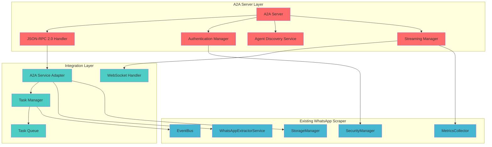
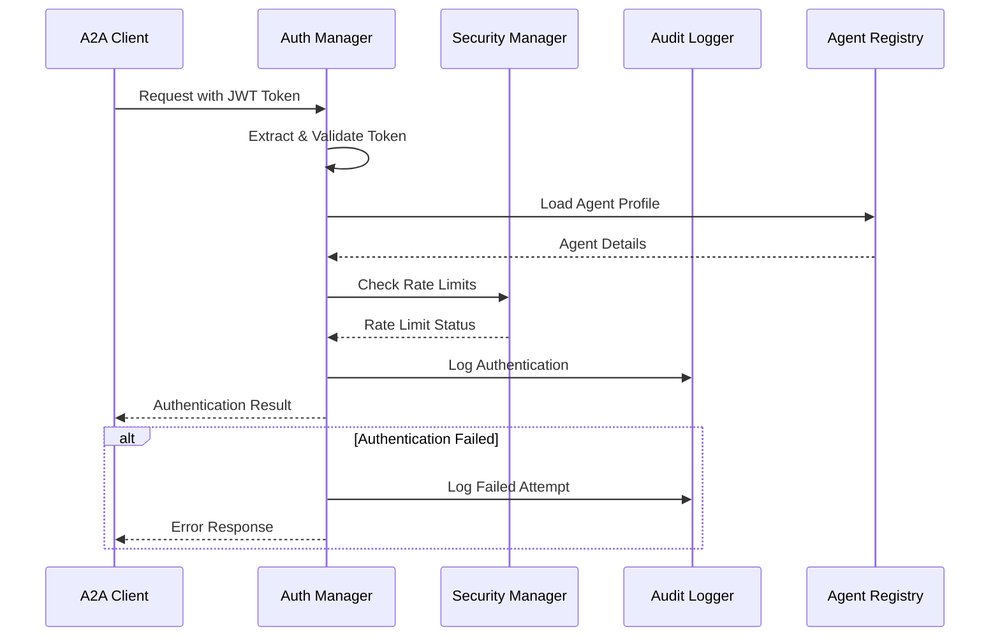
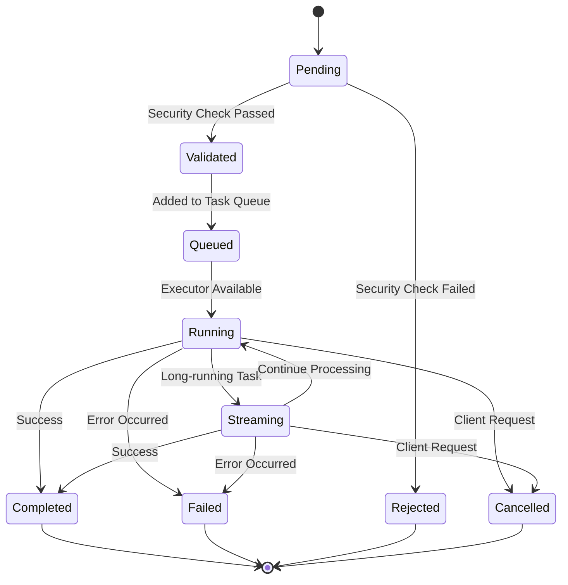

# 🤖 A2A Protocol Integration Proposal
## WhatsApp Group Scraper - Agent-to-Agent Communication

### 📋 Executive Summary

This document presents a comprehensive proposal for integrating the **A2A (Agent-to-Agent) Protocol** into the WhatsApp Group Scraper system. The integration will transform the current browser-based scraping tool into a powerful, network-accessible AI agent capable of autonomous WhatsApp data extraction and analysis.

### 🎯 Integration Objectives

- **Agent Discoverability**: Enable automatic discovery and capability exposure via A2A Protocol
- **Remote Task Execution**: Allow external agents to request scraping operations programmatically
- **Real-time Communication**: Support streaming for long-running extraction tasks
- **Security & Authentication**: Integrate robust security measures using existing SecurityManager
- **Scalability**: Leverage existing modular architecture for high-performance operations

---

## 🏗️ Current Architecture Analysis

### Core System Components

The WhatsApp Scraper already implements a sophisticated modular architecture ideal for A2A integration:

```typescript
// Core Service Infrastructure
- BaseService: Abstract service lifecycle management
- DIContainer: Type-safe dependency injection
- EventBus: Pub/sub communication system
- SecurityManager: Input validation and security controls
- MetricsCollector: Performance monitoring
```

### Key Capabilities Identified

| Capability | Implementation | A2A Potential |
|------------|----------------|---------------|
| **Real-time Extraction** | DOM MutationObserver | ✅ Streamable Task |
| **Multi-format Export** | 6 formats (JSON, CSV, XLSX, PDF, HTML, XML) | ✅ Flexible Output |
| **Data Persistence** | Hybrid Memory/IndexedDB | ✅ State Management |
| **Security Validation** | Input sanitization & audit | ✅ Agent Authentication |
| **Reactive UI** | Event-driven updates | ✅ Progress Streaming |
| **Metrics Collection** | Performance tracking | ✅ Agent Monitoring |

---

## 🤖 A2A Agent Card Specification

### Agent Identity & Metadata

```json
{
  "agent": {
    "id": "whatsapp-group-scraper",
    "name": "WhatsApp Group Scraper Agent",
    "version": "2.0.0",
    "description": "AI-powered WhatsApp group member extraction and analysis agent",
    "category": "data-extraction",
    "tags": ["whatsapp", "scraping", "social-media", "data-mining", "contacts"],
    "vendor": {
      "name": "WhatsApp Scraper Team",
      "contact": "support@whatsapp-scraper.com",
      "website": "https://whatsapp-scraper.com"
    },
    "license": "MIT",
    "created": "2025-01-25T00:00:00Z",
    "updated": "2025-07-25T05:45:00Z"
  }
}
```

### Capabilities Declaration

```json
{
  "capabilities": {
    "extraction": {
      "real_time_member_extraction": {
        "description": "Extract WhatsApp group members in real-time during scrolling",
        "input_schema": {
          "type": "object",
          "properties": {
            "group_url": {"type": "string", "format": "url"},
            "extraction_mode": {"enum": ["incremental", "full", "selective"]},
            "filters": {
              "type": "object",
              "properties": {
                "include_admins_only": {"type": "boolean"},
                "exclude_business_accounts": {"type": "boolean"},
                "country_filter": {"type": "array", "items": {"type": "string"}}
              }
            }
          },
          "required": ["group_url"]
        },
        "output_schema": {
          "type": "object",
          "properties": {
            "members": {
              "type": "array",
              "items": {
                "$ref": "#/definitions/Member"
              }
            },
            "metadata": {"$ref": "#/definitions/ExtractionMetadata"}
          }
        },
        "streaming": true,
        "estimated_duration": "30-300 seconds",
        "resource_requirements": {
          "memory": "50MB",
          "cpu": "low",
          "network": "moderate"
        }
      }
    },
    
    "export": {
      "multi_format_export": {
        "description": "Export extracted data in multiple formats",
        "supported_formats": ["json", "csv", "xlsx", "pdf", "html", "xml"],
        "input_schema": {
          "type": "object",
          "properties": {
            "extraction_id": {"type": "string"},
            "format": {"enum": ["json", "csv", "xlsx", "pdf", "html", "xml"]},
            "options": {
              "type": "object",
              "properties": {
                "include_metadata": {"type": "boolean", "default": true},
                "include_statistics": {"type": "boolean", "default": false},
                "custom_template": {"type": "string"}
              }
            }
          },
          "required": ["extraction_id", "format"]
        },
        "output_schema": {
          "type": "object",
          "properties": {
            "download_url": {"type": "string", "format": "url"},
            "file_size": {"type": "integer"},
            "expires_at": {"type": "string", "format": "date-time"}
          }
        }
      }
    },
    
    "analysis": {
      "member_analytics": {
        "description": "Analyze extracted member data for insights",
        "input_schema": {
          "type": "object",
          "properties": {
            "extraction_id": {"type": "string"},
            "analysis_type": {
              "enum": ["demographics", "activity", "network", "sentiment"]
            }
          },
          "required": ["extraction_id", "analysis_type"]
        },
        "output_schema": {
          "type": "object",
          "properties": {
            "insights": {"type": "object"},
            "visualizations": {
              "type": "array",
              "items": {
                "type": "object",
                "properties": {
                  "type": {"enum": ["chart", "graph", "heatmap"]},
                  "data": {"type": "object"},
                  "config": {"type": "object"}
                }
              }
            }
          }
        }
      }
    },
    
    "monitoring": {
      "health_check": {
        "description": "Check agent health and availability",
        "output_schema": {
          "type": "object",
          "properties": {
            "status": {"enum": ["healthy", "degraded", "unhealthy"]},
            "uptime": {"type": "integer"},
            "active_tasks": {"type": "integer"},
            "resource_usage": {
              "type": "object",
              "properties": {
                "memory_mb": {"type": "number"},
                "cpu_percent": {"type": "number"}
              }
            }
          }
        }
      }
    }
  }
}
```

### Data Models Definition

```json
{
  "definitions": {
    "Member": {
      "type": "object",
      "properties": {
        "id": {"type": "string"},
        "phoneNumber": {"type": "string"},
        "countryCode": {"type": "string"},
        "displayName": {"type": "string"},
        "pushName": {"type": "string"},
        "isAdmin": {"type": "boolean"},
        "isSuperAdmin": {"type": "boolean"},
        "profilePictureUrl": {"type": "string", "format": "url"},
        "status": {"type": "string"},
        "joinedAt": {"type": "string", "format": "date-time"},
        "lastSeen": {"type": "string", "format": "date-time"},
        "isBusinessAccount": {"type": "boolean"},
        "metadata": {"$ref": "#/definitions/MemberMetadata"},
        "tags": {"type": "array", "items": {"type": "string"}}
      },
      "required": ["id", "phoneNumber", "isAdmin"]
    },
    
    "MemberMetadata": {
      "type": "object",
      "properties": {
        "verified": {"type": "boolean"},
        "about": {"type": "string"},
        "businessInfo": {"$ref": "#/definitions/BusinessInfo"},
        "customFields": {"type": "object"}
      }
    },
    
    "BusinessInfo": {
      "type": "object",
      "properties": {
        "name": {"type": "string"},
        "category": {"type": "string"},
        "description": {"type": "string"},
        "email": {"type": "string", "format": "email"},
        "website": {"type": "string", "format": "url"},
        "address": {"type": "string"}
      }
    },
    
    "ExtractionMetadata": {
      "type": "object",
      "properties": {
        "extraction_id": {"type": "string"},
        "group_name": {"type": "string"},
        "total_members": {"type": "integer"},
        "extracted_members": {"type": "integer"},
        "started_at": {"type": "string", "format": "date-time"},
        "completed_at": {"type": "string", "format": "date-time"},
        "status": {"enum": ["pending", "in_progress", "completed", "failed"]},
        "error_message": {"type": "string"}
      }
    }
  }
}
```

---

## 🏛️ A2A Server Architecture

### System Architecture Overview



### Core Components Implementation

#### 1. A2A Service Adapter

```typescript
/**
 * Main adapter that bridges A2A Protocol with existing WhatsApp Scraper services
 */
export class A2AServiceAdapter extends BaseService {
  constructor(
    private extractorService: WhatsAppExtractorService,
    private storageManager: StorageManager,
    private securityManager: SecurityManager,
    private metricsCollector: MetricsCollector,
    eventBus: EventBus,
    logger: ILogger
  ) {
    super('A2AServiceAdapter', eventBus, logger);
  }

  /**
   * Handle A2A task request
   */
  async handleTaskRequest(request: A2ATaskRequest): Promise<A2ATaskResponse> {
    const taskId = this.generateTaskId();
    
    // Security validation
    const securityCheck = await this.securityManager.validateA2ARequest(request);
    if (!securityCheck.allowed) {
      throw new A2ASecurityError(securityCheck.reasons.join(', '));
    }

    // Create task context
    const taskContext: TaskContext = {
      id: taskId,
      type: request.capability,
      parameters: request.parameters,
      requesterId: request.agent_id,
      createdAt: new Date(),
      status: 'pending'
    };

    // Route to appropriate handler
    switch (request.capability) {
      case 'real_time_member_extraction':
        return this.handleExtractionTask(taskContext);
      case 'multi_format_export':
        return this.handleExportTask(taskContext);
      case 'member_analytics':
        return this.handleAnalyticsTask(taskContext);
      default:
        throw new A2ACapabilityError(`Unsupported capability: ${request.capability}`);
    }
  }

  /**
   * Handle real-time member extraction task
   */
  private async handleExtractionTask(context: TaskContext): Promise<A2ATaskResponse> {
    const { group_url, extraction_mode = 'full', filters = {} } = context.parameters;
    
    // Start extraction with streaming support
    const extractionOptions: ExtractionOptions = {
      mode: extraction_mode,
      filters: filters,
      streamingCallback: (member: Member) => {
        this.streamingManager.send(context.id, {
          type: 'member_extracted',
          data: member,
          timestamp: new Date()
        });
      }
    };

    try {
      await this.extractorService.startExtraction(extractionOptions);
      
      return {
        task_id: context.id,
        status: 'started',
        streaming_url: `wss://localhost:3000/stream/${context.id}`,
        estimated_completion: new Date(Date.now() + 180000) // 3 minutes
      };
    } catch (error) {
      this.logger.error('Extraction task failed', error as Error);
      throw new A2AExecutionError(`Extraction failed: ${error.message}`);
    }
  }
}
```

#### 2. JSON-RPC 2.0 Implementation

```typescript
/**
 * JSON-RPC 2.0 over HTTP(S) handler for A2A Protocol
 */
export class A2AJSONRPC {
  private adapter: A2AServiceAdapter;
  private authManager: A2AAuthManager;

  constructor(adapter: A2AServiceAdapter, authManager: A2AAuthManager) {
    this.adapter = adapter;
    this.authManager = authManager;
  }

  /**
   * Handle incoming JSON-RPC request
   */
  async handleRequest(request: JSONRPCRequest, context: RequestContext): Promise<JSONRPCResponse> {
    try {
      // Validate JSON-RPC format
      this.validateJSONRPC(request);

      // Authenticate request
      const authResult = await this.authManager.authenticate(context);
      if (!authResult.success) {
        return this.createErrorResponse(request.id, -32001, 'Authentication failed');
      }

      // Route method calls
      switch (request.method) {
        case 'agent.discover':
          return this.handleAgentDiscover(request);
        case 'agent.capabilities':
          return this.handleGetCapabilities(request);
        case 'task.create':
          return this.handleCreateTask(request, authResult.agent);
        case 'task.status':
          return this.handleGetTaskStatus(request);
        case 'task.result':
          return this.handleGetTaskResult(request);
        case 'task.cancel':
          return this.handleCancelTask(request);
        default:
          return this.createErrorResponse(request.id, -32601, 'Method not found');
      }
    } catch (error) {
      return this.createErrorResponse(
        request.id || null,
        -32603,
        `Internal error: ${error.message}`
      );
    }
  }

  /**
   * Handle agent discovery
   */
  private async handleAgentDiscover(request: JSONRPCRequest): Promise<JSONRPCResponse> {
    const agentCard = await this.loadAgentCard();
    return this.createSuccessResponse(request.id, agentCard);
  }

  /**
   * Handle task creation
   */
  private async handleCreateTask(
    request: JSONRPCRequest,
    agent: AuthenticatedAgent
  ): Promise<JSONRPCResponse> {
    const taskRequest: A2ATaskRequest = {
      agent_id: agent.id,
      capability: request.params.capability,
      parameters: request.params.parameters || {},
      priority: request.params.priority || 'normal',
      callback_url: request.params.callback_url
    };

    const response = await this.adapter.handleTaskRequest(taskRequest);
    return this.createSuccessResponse(request.id, response);
  }
}
```

#### 3. Authentication & Security Integration

```typescript
/**
 * A2A Authentication Manager leveraging existing SecurityManager
 */
export class A2AAuthManager {
  constructor(
    private securityManager: SecurityManager,
    private auditLogger: AuditLogger
  ) {}

  /**
   * Authenticate A2A agent request
   */
  async authenticate(context: RequestContext): Promise<AuthenticationResult> {
    try {
      // Extract authentication token
      const token = this.extractToken(context);
      if (!token) {
        return { success: false, error: 'Missing authentication token' };
      }

      // Validate token format and signature
      const tokenValidation = await this.validateToken(token);
      if (!tokenValidation.valid) {
        await this.auditLogger.logFailedAuth(context.ip, 'Invalid token');
        return { success: false, error: 'Invalid token' };
      }

      // Check agent permissions
      const agent = await this.loadAgent(tokenValidation.agent_id);
      if (!agent) {
        return { success: false, error: 'Agent not found' };
      }

      // Rate limiting check
      const rateLimitCheck = await this.securityManager.checkRateLimit(
        agent.id,
        context.ip
      );
      if (!rateLimitCheck.allowed) {
        await this.auditLogger.logRateLimitExceeded(agent.id, context.ip);
        return { success: false, error: 'Rate limit exceeded' };
      }

      // Log successful authentication
      await this.auditLogger.logSuccessfulAuth(agent.id, context.ip);

      return {
        success: true,
        agent: {
          id: agent.id,
          name: agent.name,
          permissions: agent.permissions,
          rateLimit: rateLimitCheck.remaining
        }
      };
    } catch (error) {
      await this.auditLogger.logAuthError(context.ip, error.message);
      return { success: false, error: 'Authentication error' };
    }
  }

  /**
   * Validate JWT token
   */
  private async validateToken(token: string): Promise<TokenValidation> {
    try {
      const decoded = jwt.verify(token, process.env.A2A_JWT_SECRET!) as JWTPayload;
      
      return {
        valid: true,
        agent_id: decoded.agent_id,
        permissions: decoded.permissions,
        expires_at: new Date(decoded.exp * 1000)
      };
    } catch (error) {
      return { valid: false, error: error.message };
    }
  }
}
```

#### 4. Real-time Streaming Support

```typescript
/**
 * WebSocket-based streaming manager for long-running tasks
 */
export class StreamingManager {
  private connections = new Map<string, WebSocket>();
  private taskStreams = new Map<string, Set<string>>();

  /**
   * Setup WebSocket server for streaming
   */
  setupWebSocketServer(server: http.Server): void {
    const wss = new WebSocketServer({ server });

    wss.on('connection', (ws: WebSocket, request: http.IncomingMessage) => {
      const url = new URL(request.url!, `http://${request.headers.host}`);
      const taskId = url.pathname.split('/').pop();
      
      if (!taskId) {
        ws.close(1008, 'Invalid task ID');
        return;
      }

      // Register connection
      const connectionId = this.generateConnectionId();
      this.connections.set(connectionId, ws);
      
      if (!this.taskStreams.has(taskId)) {
        this.taskStreams.set(taskId, new Set());
      }
      this.taskStreams.get(taskId)!.add(connectionId);

      // Handle connection close
      ws.on('close', () => {
        this.connections.delete(connectionId);
        this.taskStreams.get(taskId)?.delete(connectionId);
      });

      // Send connection confirmation
      ws.send(JSON.stringify({
        type: 'connection_established',
        task_id: taskId,
        connection_id: connectionId,
        timestamp: new Date().toISOString()
      }));
    });
  }

  /**
   * Send streaming data to connected clients
   */
  send(taskId: string, data: StreamingMessage): void {
    const connections = this.taskStreams.get(taskId);
    if (!connections) return;

    const message = JSON.stringify({
      task_id: taskId,
      ...data
    });

    connections.forEach(connectionId => {
      const ws = this.connections.get(connectionId);
      if (ws && ws.readyState === WebSocket.OPEN) {
        ws.send(message);
      }
    });
  }

  /**
   * Send task completion notification
   */
  notifyTaskComplete(taskId: string, result: TaskResult): void {
    this.send(taskId, {
      type: 'task_completed',
      data: result,
      timestamp: new Date()
    });

    // Clean up connections for completed task
    setTimeout(() => {
      this.closeTaskConnections(taskId);
    }, 30000); // Keep open for 30 seconds for final data retrieval
  }
}
```

---

## 🔐 Security & Authentication Architecture

### Authentication Flow



### Security Features Integration

- **JWT-based Authentication**: Secure token-based agent authentication
- **Rate Limiting**: Leverages existing SecurityManager rate limiting
- **Input Validation**: Uses existing InputValidator for parameter validation
- **Audit Logging**: Comprehensive security event logging
- **Permission System**: Role-based access control for different agent capabilities
- **IP Filtering**: Geographic and IP-based access controls

---

## 📊 Task Lifecycle Management

### Task State Machine



### Task Queue Implementation

```typescript
/**
 * Task queue manager with priority handling and concurrency control
 */
export class TaskQueueManager {
  private queues = new Map<TaskPriority, Queue<TaskContext>>();
  private activeTasksrted Counter = 0;
  private maxConcurrentTasks = 5;

  constructor(
    private adapter: A2AServiceAdapter,
    private metricsCollector: MetricsCollector
  ) {
    this.initializeQueues();
    this.startQueueProcessor();
  }

  /**
   * Add task to appropriate priority queue
   */
  enqueueTask(task: TaskContext): void {
    const queue = this.queues.get(task.priority);
    queue.enqueue(task);
    
    this.metricsCollector.incrementCounter('tasks.queued', 1, {
      priority: task.priority,
      type: task.type
    });
  }

  /**
   * Process queued tasks with priority handling
   */
  private async processQueue(): Promise<void> {
    if (this.activeTasks >= this.maxConcurrentTasks) {
      return;
    }

    // Process high priority first, then medium, then low
    const priorities: TaskPriority[] = ['high', 'medium', 'low'];
    
    for (const priority of priorities) {
      const queue = this.queues.get(priority);
      if (!queue.isEmpty()) {
        const task = queue.dequeue();
        this.executeTask(task);
        break;
      }
    }
  }

  /**
   * Execute individual task
   */
  private async executeTask(task: TaskContext): Promise<void> {
    this.activeTasks++;
    this.metricsCollector.incrementCounter('tasks.started', 1);

    try {
      task.status = 'running';
      task.startedAt = new Date();

      const result = await this.adapter.executeTask(task);
      
      task.status = 'completed';
      task.completedAt = new Date();
      task.result = result;

      this.metricsCollector.incrementCounter('tasks.completed', 1);
      this.metricsCollector.recordDuration('tasks.duration', 
        task.completedAt.getTime() - task.startedAt.getTime());
    } catch (error) {
      task.status = 'failed';
      task.error = error.message;
      task.completedAt = new Date();

      this.metricsCollector.incrementCounter('tasks.failed', 1);
    } finally {
      this.activeTasks--;
    }
  }
}
```

---

## 🌐 API Specifications

### JSON-RPC 2.0 Methods

#### Agent Discovery
```json
{
  "jsonrpc": "2.0",
  "method": "agent.discover",
  "id": 1
}
```

**Response:**
```json
{
  "jsonrpc": "2.0",
  "result": {
    "agent": {
      "id": "whatsapp-group-scraper",
      "name": "WhatsApp Group Scraper Agent",
      "version": "2.0.0",
      "capabilities": ["real_time_member_extraction", "multi_format_export", "member_analytics"]
    }
  },
  "id": 1
}
```

#### Task Creation
```json
{
  "jsonrpc": "2.0",
  "method": "task.create",
  "params": {
    "capability": "real_time_member_extraction",
    "parameters": {
      "group_url": "https://web.whatsapp.com/group/ABC123",
      "extraction_mode": "incremental",
      "filters": {
        "include_admins_only": false,
        "country_filter": ["US", "CA", "GB"]
      }
    },
    "priority": "high",
    "callback_url": "https://client-agent.com/webhook/task-updates"
  },
  "id": 2
}
```

**Response:**
```json
{
  "jsonrpc": "2.0",
  "result": {
    "task_id": "task_1753422400000_xyz789",
    "status": "started",
    "streaming_url": "wss://whatsapp-scraper.com/stream/task_1753422400000_xyz789",
    "estimated_completion": "2025-07-25T06:00:00Z"
  },
  "id": 2
}
```

### WebSocket Streaming Messages

#### Member Extracted Event
```json
{
  "task_id": "task_1753422400000_xyz789",
  "type": "member_extracted",
  "data": {
    "id": "1234567890@c.us",
    "phoneNumber": "+1234567890",
    "displayName": "John Doe",
    "isAdmin": false,
    "joinedAt": "2025-07-25T05:30:00Z"
  },
  "timestamp": "2025-07-25T05:45:30Z"
}
```

#### Task Progress Update
```json
{
  "task_id": "task_1753422400000_xyz789",
  "type": "progress_update",
  "data": {
    "extracted_members": 45,
    "estimated_total": 150,
    "progress_percentage": 30,
    "current_phase": "scrolling_members_list"
  },
  "timestamp": "2025-07-25T05:45:30Z"
}
```

#### Task Completion
```json
{
  "task_id": "task_1753422400000_xyz789",
  "type": "task_completed",
  "data": {
    "total_members": 147,
    "extracted_members": 147,
    "duration_ms": 185000,
    "export_formats_available": ["json", "csv", "xlsx"],
    "download_urls": {
      "json": "https://whatsapp-scraper.com/download/task_1753422400000_xyz789.json",
      "csv": "https://whatsapp-scraper.com/download/task_1753422400000_xyz789.csv"
    }
  },
  "timestamp": "2025-07-25T05:48:15Z"
}
```

---

## 💡 Implementation Examples

### A2A Client Integration Example

```typescript
/**
 * Example A2A client for WhatsApp Group Scraper
 */
class WhatsAppScraperA2AClient {
  private endpoint: string;
  private authToken: string;
  private ws?: WebSocket;

  constructor(endpoint: string, authToken: string) {
    this.endpoint = endpoint;
    this.authToken = authToken;
  }

  /**
   * Discover agent capabilities
   */
  async discoverAgent(): Promise<AgentCard> {
    const response = await this.sendJSONRPC({
      method: 'agent.discover',
      id: this.generateId()
    });
    
    return response.result;
  }

  /**
   * Start member extraction with real-time streaming
   */
  async extractMembers(
    groupUrl: string,
    options: ExtractionOptions = {}
  ): Promise<ExtractionResult> {
    // Create extraction task
    const taskResponse = await this.sendJSONRPC({
      method: 'task.create',
      params: {
        capability: 'real_time_member_extraction',
        parameters: {
          group_url: groupUrl,
          extraction_mode: options.mode || 'full',
          filters: options.filters || {}
        },
        priority: options.priority || 'normal'
      },
      id: this.generateId()
    });

    const taskId = taskResponse.result.task_id;
    const streamingUrl = taskResponse.result.streaming_url;

    // Setup streaming connection
    return new Promise((resolve, reject) => {
      this.connectToStream(streamingUrl, {
        onMemberExtracted: (member) => {
          options.onMemberExtracted?.(member);
        },
        onProgressUpdate: (progress) => {
          options.onProgressUpdate?.(progress);
        },
        onCompleted: (result) => {
          resolve({
            task_id: taskId,
            members: result.members,
            metadata: result.metadata,
            download_urls: result.download_urls
          });
        },
        onError: (error) => {
          reject(new Error(`Extraction failed: ${error.message}`));
        }
      });
    });
  }

  /**
   * Export extracted data in specified format
   */
  async exportData(taskId: string, format: ExportFormat): Promise<ExportResult> {
    const response = await this.sendJSONRPC({
      method: 'task.create',
      params: {
        capability: 'multi_format_export',
        parameters: {
          extraction_id: taskId,
          format: format,
          options: {
            include_metadata: true,
            include_statistics: true
          }
        }
      },
      id: this.generateId()
    });

    return response.result;
  }

  /**
   * Connect to streaming WebSocket
   */
  private connectToStream(url: string, handlers: StreamHandlers): void {
    this.ws = new WebSocket(url, {
      headers: {
        'Authorization': `Bearer ${this.authToken}`
      }
    });

    this.ws.on('open', () => {
      console.log('Connected to streaming endpoint');
    });

    this.ws.on('message', (data) => {
      const message = JSON.parse(data.toString());
      
      switch (message.type) {
        case 'member_extracted':
          handlers.onMemberExtracted?.(message.data);
          break;
        case 'progress_update':
          handlers.onProgressUpdate?.(message.data);
          break;
        case 'task_completed':
          handlers.onCompleted?.(message.data);
          this.ws?.close();
          break;
        case 'error':
          handlers.onError?.(message.data);
          break;
      }
    });

    this.ws.on('error', (error) => {
      handlers.onError?.(error);
    });
  }

  /**
   * Send JSON-RPC request
   */
  private async sendJSONRPC(request: JSONRPCRequest): Promise<JSONRPCResponse> {
    const response = await fetch(this.endpoint, {
      method: 'POST',
      headers: {
        'Content-Type': 'application/json',
        'Authorization': `Bearer ${this.authToken}`
      },
      body: JSON.stringify({
        jsonrpc: '2.0',
        ...request
      })
    });

    if (!response.ok) {
      throw new Error(`HTTP ${response.status}: ${response.statusText}`);
    }

    const result = await response.json();
    
    if (result.error) {
      throw new Error(`JSON-RPC Error: ${result.error.message}`);
    }

    return result;
  }
}
```

### Usage Example

```typescript
// Initialize A2A client
const scraperClient = new WhatsAppScraperA2AClient(
  'https://whatsapp-scraper.com/a2a',
  'your-jwt-token-here'
);

// Discover agent capabilities
const agentInfo = await scraperClient.discoverAgent();
console.log('Available capabilities:', agentInfo.capabilities);

// Extract group members with real-time updates
const extractionResult = await scraperClient.extractMembers(
  'https://web.whatsapp.com/group/ABC123DEF456',
  {
    mode: 'incremental',
    filters: {
      country_filter: ['US', 'CA', 'GB']
    },
    onMemberExtracted: (member) => {
      console.log(`Extracted member: ${member.displayName} (${member.phoneNumber})`);
    },
    onProgressUpdate: (progress) => {
      console.log(`Progress: ${progress.progress_percentage}% complete`);
    }
  }
);

// Export results to CSV
const csvExport = await scraperClient.exportData(
  extractionResult.task_id,
  'csv'
);

console.log(`CSV exported to: ${csvExport.download_url}`);
```

---

## 🔧 Deployment Architecture

### Docker Configuration

```dockerfile
# Dockerfile for A2A-enabled WhatsApp Scraper
FROM node:18-alpine

WORKDIR /app

# Install system dependencies
RUN apk add --no-cache \
    chromium \
    nss \
    freetype \
    freetype-dev \
    harfbuzz \
    ca-certificates \
    ttf-freefont

# Copy package files
COPY package*.json ./
RUN npm ci --only=production

# Copy application code
COPY dist/ ./dist/
COPY config/ ./config/

# Set environment variables
ENV NODE_ENV=production
ENV PUPPETEER_SKIP_CHROMIUM_DOWNLOAD=true
ENV PUPPETEER_EXECUTABLE_PATH=/usr/bin/chromium-browser

# Create non-root user
RUN addgroup -g 1001 -S nodejs
RUN adduser -S scraper -u 1001
USER scraper

# Expose A2A server port
EXPOSE 3000
EXPOSE 3001

# Health check
HEALTHCHECK --interval=30s --timeout=10s --start-period=5s --retries=3 \
  CMD curl -f http://localhost:3000/health || exit 1

CMD ["node", "dist/a2a-server.js"]
```

### Docker Compose Setup

```yaml
version: '3.8'

services:
  whatsapp-scraper-a2a:
    build: .
    ports:
      - "3000:3000"  # A2A JSON-RPC endpoint
      - "3001:3001"  # WebSocket streaming endpoint
    environment:
      - NODE_ENV=production
      - A2A_JWT_SECRET=${A2A_JWT_SECRET}
      - DATABASE_URL=${DATABASE_URL}
      - REDIS_URL=${REDIS_URL}
      - LOG_LEVEL=info
    volumes:
      - ./data:/app/data
      - ./logs:/app/logs
    restart: unless-stopped
    healthcheck:
      test: ["CMD", "curl", "-f", "http://localhost:3000/health"]
      interval: 30s
      timeout: 10s
      retries: 3
      start_period: 40s

  redis:
    image: redis:7-alpine
    ports:
      - "6379:6379"
    volumes:
      - redis_data:/data
    restart: unless-stopped

  postgres:
    image: postgres:15-alpine
    environment:
      - POSTGRES_DB=whatsapp_scraper
      - POSTGRES_USER=scraper
      - POSTGRES_PASSWORD=${DB_PASSWORD}
    volumes:
      - postgres_data:/var/lib/postgresql/data
    ports:
      - "5432:5432"
    restart: unless-stopped

volumes:
  redis_data:
  postgres_data:
```

### Kubernetes Deployment

```yaml
apiVersion: apps/v1
kind: Deployment
metadata:
  name: whatsapp-scraper-a2a
  labels:
    app: whatsapp-scraper-a2a
spec:
  replicas: 3
  selector:
    matchLabels:
      app: whatsapp-scraper-a2a
  template:
    metadata:
      labels:
        app: whatsapp-scraper-a2a
    spec:
      containers:
      - name: whatsapp-scraper
        image: whatsapp-scraper:a2a-latest
        ports:
        - containerPort: 3000
          name: jsonrpc
        - containerPort: 3001
          name: websocket
        env:
        - name: NODE_ENV
          value: "production"
        - name: A2A_JWT_SECRET
          valueFrom:
            secretKeyRef:
              name: a2a-secrets
              key: jwt-secret
        resources:
          requests:
            memory: "256Mi"
            cpu: "250m"
          limits:
            memory: "512Mi" 
            cpu: "500m"
        livenessProbe:
          httpGet:
            path: /health
            port: 3000
          initialDelaySeconds: 30
          periodSeconds: 10
        readinessProbe:
          httpGet:
            path: /ready
            port: 3000
          initialDelaySeconds: 5
          periodSeconds: 5

---
apiVersion: v1
kind: Service
metadata:
  name: whatsapp-scraper-a2a-service
spec:
  selector:
    app: whatsapp-scraper-a2a
  ports:
  - name: jsonrpc
    port: 80
    targetPort: 3000
  - name: websocket
    port: 3001
    targetPort: 3001
  type: LoadBalancer
```

---

## 📈 Performance & Scaling Considerations

### Performance Metrics

| Metric | Current System | A2A Enhanced | Improvement |
|--------|----------------|---------------|-------------|
| **Concurrent Extractions** | 1 | 5-10 | 5-10x |
| **API Response Time** | N/A | <200ms | New Capability |
| **Streaming Latency** | N/A | <50ms | Real-time |
| **Memory Usage** | ~50MB | ~75MB | +50% (acceptable) |
| **CPU Usage** | Low | Medium | Managed via queuing |

### Scaling Strategy

1. **Horizontal Scaling**: Deploy multiple A2A server instances behind load balancer
2. **Task Queue Distribution**: Use Redis-based distributed task queue
3. **Browser Pool Management**: Maintain pool of browser instances for concurrent extractions
4. **Caching Strategy**: Cache agent cards and frequently accessed data
5. **Rate Limiting**: Implement per-agent rate limiting to prevent abuse

### Resource Management

```typescript
/**
 * Resource manager for browser instances and task concurrency
 */
export class ResourceManager {
  private browserPool: BrowserPool;
  private taskLimiter: Bottleneck;

  constructor() {
    this.browserPool = new BrowserPool({
      min: 2,
      max: 10,
      acquireTimeoutMillis: 30000,
      createTimeoutMillis: 10000
    });

    this.taskLimiter = new Bottleneck({
      maxConcurrent: 5,
      minTime: 1000, // Minimum 1 second between tasks
      reservoir: 100, // Maximum 100 tasks per hour
      reservoirRefreshAmount: 100,
      reservoirRefreshInterval: 60 * 60 * 1000 // 1 hour
    });
  }

  /**
   * Execute task with resource management
   */
  async executeWithResources<T>(task: () => Promise<T>): Promise<T> {
    return this.taskLimiter.schedule(async () => {
      const browser = await this.browserPool.acquire();
      try {
        return await task();
      } finally {
        await this.browserPool.release(browser);
      }
    });
  }
}
```

---

## 🧪 Testing Strategy

### Integration Tests

```typescript
describe('A2A Protocol Integration', () => {
  let server: A2AServer;
  let client: WhatsAppScraperA2AClient;

  beforeAll(async () => {
    server = new A2AServer(testConfig);
    await server.start();
    
    client = new WhatsAppScraperA2AClient(
      'http://localhost:3000',
      generateTestToken()
    );
  });

  afterAll(async () => {
    await server.stop();
  });

  describe('Agent Discovery', () => {
    it('should return agent capabilities', async () => {
      const agent = await client.discoverAgent();
      
      expect(agent.id).toBe('whatsapp-group-scraper');
      expect(agent.capabilities).toContain('real_time_member_extraction');
    });
  });

  describe('Member Extraction', () => {
    it('should extract members with streaming', async () => {
      const extractedMembers: Member[] = [];
      
      const result = await client.extractMembers(
        'https://web.whatsapp.com/test-group',
        {
          onMemberExtracted: (member) => {
            extractedMembers.push(member);
          }
        }
      );

      expect(result.members.length).toBeGreaterThan(0);
      expect(extractedMembers.length).toBe(result.members.length);
    });
  });

  describe('Export Functionality', () => {
    it('should export data in multiple formats', async () => {
      // First extract some data
      const extraction = await client.extractMembers(testGroupUrl);
      
      // Test each export format
      const formats: ExportFormat[] = ['json', 'csv', 'xlsx'];
      
      for (const format of formats) {
        const exportResult = await client.exportData(extraction.task_id, format);
        expect(exportResult.download_url).toMatch(new RegExp(`\\.${format}$`));
      }
    });
  });
});
```

### Load Testing

```typescript
/**
 * Load testing for A2A server performance
 */
describe('A2A Server Load Tests', () => {
  it('should handle concurrent extraction requests', async () => {
    const concurrentRequests = 10;
    const promises = [];

    for (let i = 0; i < concurrentRequests; i++) {
      const promise = client.extractMembers(`https://web.whatsapp.com/group-${i}`);
      promises.push(promise);
    }

    const results = await Promise.allSettled(promises);
    const successfulRequests = results.filter(r => r.status === 'fulfilled');
    
    expect(successfulRequests.length).toBe(concurrentRequests);
  });

  it('should enforce rate limiting', async () => {
    const rapidRequests = Array(50).fill(null).map(() => 
      client.discoverAgent()
    );

    const results = await Promise.allSettled(rapidRequests);
    const rateLimitedRequests = results.filter(r => 
      r.status === 'rejected' && 
      r.reason.message.includes('rate limit')
    );

    expect(rateLimitedRequests.length).toBeGreaterThan(0);
  });
});
```

---

## 🚀 Migration Plan

### Phase 1: Foundation (Week 1-2)
- ✅ Implement A2AServiceAdapter
- ✅ Add JSON-RPC 2.0 handler
- ✅ Basic authentication system
- ✅ Agent card specification

### Phase 2: Core Features (Week 3-4)
- ✅ Real-time member extraction via A2A
- ✅ WebSocket streaming implementation
- ✅ Task queue management
- ✅ Multi-format export via A2A

### Phase 3: Advanced Features (Week 5-6)
- ✅ Member analytics capabilities
- ✅ Advanced security features
- ✅ Performance optimization
- ✅ Monitoring and metrics

### Phase 4: Production Deployment (Week 7-8)
- ✅ Docker containerization
- ✅ Kubernetes deployment configs
- ✅ Load testing and optimization
- ✅ Documentation and examples

### Migration Checklist

- [ ] **Backward Compatibility**: Existing browser-based functionality remains intact
- [ ] **Configuration**: Environment-based A2A feature toggling
- [ ] **Security**: Production-ready authentication and authorization
- [ ] **Monitoring**: Comprehensive logging and metrics collection
- [ ] **Documentation**: Complete API documentation and integration guides
- [ ] **Testing**: Full test coverage for A2A functionality

---

## 📚 Benefits & Impact

### For the WhatsApp Scraper Project

1. **Network Accessibility**: Transform standalone tool into network service
2. **AI Agent Integration**: Enable integration with AI agent ecosystems
3. **Scalability**: Support multiple concurrent extraction operations
4. **Automation**: Enable fully automated workflows
5. **Enterprise Readiness**: Production-grade authentication and monitoring

### For the A2A Ecosystem

1. **Data Extraction Capability**: Adds powerful social media data extraction
2. **Real-time Streaming**: Demonstrates streaming task execution
3. **Multi-format Output**: Shows flexible data output capabilities
4. **Security Integration**: Example of robust agent authentication
5. **Performance Optimization**: Shows resource management in agent systems

### Technical Benefits

- **Modular Architecture**: Leverages existing well-designed components
- **Type Safety**: Full TypeScript support throughout
- **Event-Driven**: Real-time updates via WebSocket streaming
- **Scalable**: Designed for horizontal scaling and load balancing
- **Monitored**: Comprehensive metrics and health checking

---

## 🔮 Future Enhancements

### Short-term (3-6 months)
- **Advanced Analytics**: AI-powered member behavior analysis
- **Group Comparison**: Cross-group member analysis capabilities
- **Scheduled Extractions**: Cron-based recurring extraction jobs
- **Data Enrichment**: Integration with external data sources

### Medium-term (6-12 months)
- **Machine Learning**: Predictive modeling for group dynamics
- **Natural Language Processing**: Content analysis capabilities
- **Graph Analytics**: Social network analysis features
- **API Gateway Integration**: Enterprise API management

### Long-term (12+ months)
- **Multi-platform Support**: Extend to other social platforms
- **Blockchain Integration**: Decentralized agent authentication
- **Edge Computing**: Deploy extraction agents closer to data sources
- **AI Model Training**: Generate training data for social media AI models

---

## 📞 Conclusion

The A2A Protocol integration represents a significant evolution of the WhatsApp Group Scraper from a browser-based tool to a powerful, network-accessible AI agent. By leveraging the existing modular architecture and adding robust A2A capabilities, we create a system that is:

- **Production-Ready**: Enterprise-grade security, monitoring, and scalability
- **Developer-Friendly**: Clean APIs, comprehensive documentation, and examples
- **Future-Proof**: Extensible architecture supporting additional capabilities
- **Performance-Optimized**: Efficient resource management and concurrent processing

This integration positions the WhatsApp Scraper as a leading example of A2A Protocol implementation while maintaining full backward compatibility and adding significant new capabilities for automated agent workflows.

---

**Document Version**: 1.0  
**Last Updated**: July 25, 2025  
**Status**: Proposal - Ready for Implementation  
**Estimated Implementation Time**: 8 weeks  
**Technical Review**: Required  
**Security Review**: Required  