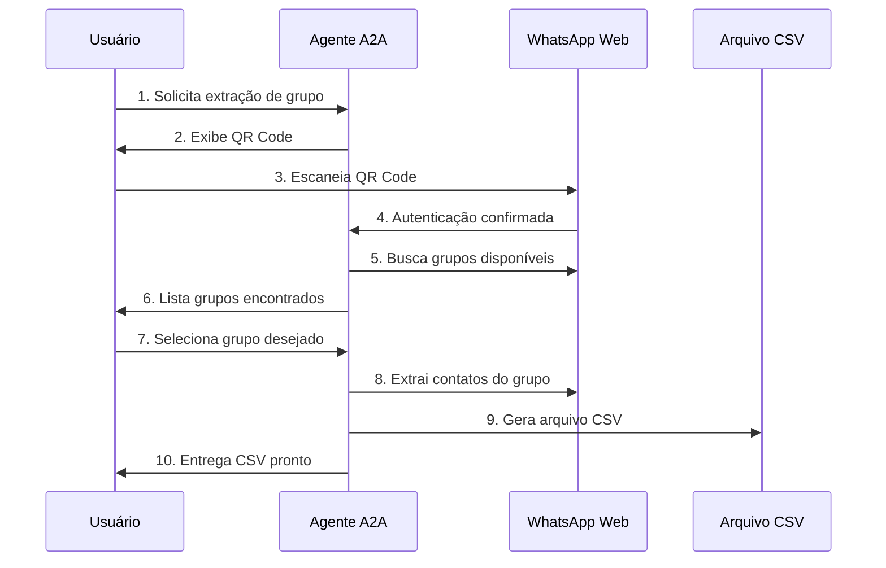

# 🤖 A2A Protocol Integration - Fluxo Simplificado
## WhatsApp Group Scraper - Integração Direta e Intuitiva

### 📋 Resumo Executivo

Esta proposta apresenta uma integração **simplificada e user-friendly** do protocolo A2A no WhatsApp Group Scraper, focando em um fluxo direto de 4 etapas que maximiza a usabilidade e minimiza a complexidade técnica.

### 🎯 Fluxo do Usuário Proposto



---

## 🚀 Fluxo Simplificado - 4 Etapas

### **Etapa 1: QR Code Authentication**
```
👤 Usuário → 🤖 Agente: "Quero extrair contatos de um grupo"
🤖 Agente → 👤 Usuário: Exibe QR Code do WhatsApp Web
```

### **Etapa 2: Group Discovery** 
```
🤖 Agente → 📱 WhatsApp: Busca grupos disponíveis
🤖 Agente → 👤 Usuário: Lista de grupos encontrados
```

### **Etapa 3: Group Selection**
```
👤 Usuário → 🤖 Agente: Seleciona grupo "Grupo da Família"
🤖 Agente → 📱 WhatsApp: Inicia extração do grupo selecionado
```

### **Etapa 4: CSV Delivery**
```
🤖 Agente → 📄 CSV: Gera arquivo com contatos extraídos
🤖 Agente → 👤 Usuário: Entrega CSV pronto para download
```

---

## 📋 A2A Agent Card Simplificado

### Identidade do Agente
```json
{
  "agent": {
    "id": "whatsapp-simple-scraper",
    "name": "WhatsApp Group Scraper - Versão Simplificada",
    "version": "1.0.0",
    "description": "Extração simplificada de contatos de grupos WhatsApp via QR code",
    "category": "social-media-tools",
    "tags": ["whatsapp", "contacts", "csv", "simple"],
    "user_flow": {
      "steps": 4,
      "estimated_time": "2-5 minutos",
      "complexity": "beginner-friendly"
    }
  }
}
```

### Capacidades Principais
```json
{
  "capabilities": {
    "qr_authentication": {
      "description": "Autenticação via QR code do WhatsApp Web",
      "method": "authenticate_qr",
      "input": {
        "session_id": "string"
      },
      "output": {
        "qr_code": "base64_image",
        "qr_url": "string",
        "status": "pending|authenticated|expired"
      }
    },
    
    "group_discovery": {
      "description": "Lista grupos disponíveis para extração",
      "method": "list_groups", 
      "requires": "authenticated_session",
      "output": {
        "groups": [
          {
            "id": "string",
            "name": "string", 
            "member_count": "number",
            "last_activity": "datetime"
          }
        ]
      }
    },
    
    "group_extraction": {
      "description": "Extrai contatos do grupo selecionado e retorna CSV",
      "method": "extract_group_csv",
      "input": {
        "session_id": "string",
        "group_id": "string"
      },
      "output": {
        "csv_data": "string",
        "download_url": "string",
        "member_count": "number",
        "extraction_time": "datetime"
      }
    }
  }
}
```

---

## 🏗️ Arquitetura Técnica Simplificada

### Componentes Principais

```typescript
/**
 * Arquitetura simplificada focada no fluxo do usuário
 */
class SimplifiedA2AServer {
  // Componentes essenciais
  private qrAuthManager: QRAuthenticationManager;
  private groupDiscovery: GroupDiscoveryService; 
  private csvExtractor: CSVExtractionService;
  private sessionManager: SessionManager;
}
```

### JSON-RPC Methods

#### 1. Authenticate QR
```json
{
  "jsonrpc": "2.0",
  "method": "authenticate_qr",
  "params": {
    "session_id": "user_session_123"
  },
  "id": 1
}
```

**Response:**
```json
{
  "jsonrpc": "2.0", 
  "result": {
    "qr_code": "data:image/png;base64,iVBORw0KGgoAAAANSUhEUgAA...",
    "qr_url": "https://web.whatsapp.com/qr/ABC123DEF456",
    "status": "pending",
    "expires_in": 120
  },
  "id": 1
}
```

#### 2. List Groups
```json
{
  "jsonrpc": "2.0",
  "method": "list_groups", 
  "params": {
    "session_id": "user_session_123"
  },
  "id": 2
}
```

**Response:**
```json
{
  "jsonrpc": "2.0",
  "result": {
    "groups": [
      {
        "id": "120363042341234567@g.us",
        "name": "Grupo da Família",
        "member_count": 15,
        "last_activity": "2025-07-25T10:30:00Z",
        "description": "Nosso grupo da família ❤️"
      },
      {
        "id": "120363042341234568@g.us", 
        "name": "Trabalho - Equipe Marketing",
        "member_count": 8,
        "last_activity": "2025-07-25T09:15:00Z",
        "description": "Coordenação da equipe"
      }
    ],
    "total_groups": 2
  },
  "id": 2
}
```

#### 3. Extract Group CSV  
```json
{
  "jsonrpc": "2.0",
  "method": "extract_group_csv",
  "params": {
    "session_id": "user_session_123",
    "group_id": "120363042341234567@g.us"
  },
  "id": 3
}
```

**Response:**
```json
{
  "jsonrpc": "2.0",
  "result": {
    "csv_data": "Nome,Telefone,Descrição,Admin\nJoão Silva,+5511999887766,Desenvolvedor,false\nMaria Santos,+5511888776655,Designer,true\n...",
    "download_url": "https://api.whatsapp-scraper.com/download/grupo_familia_20250725.csv",
    "member_count": 15,
    "extraction_time": "2025-07-25T10:45:23Z",
    "file_size": "2.1 KB",
    "expires_in": 3600
  },
  "id": 3
}
```

---

## 💻 Implementação dos Componentes

### 1. QR Authentication Manager

```typescript
/**
 * Gerenciador de autenticação via QR code
 */
export class QRAuthenticationManager {
  private sessions = new Map<string, WhatsAppSession>();

  /**
   * Inicia processo de autenticação QR
   */
  async startQRAuthentication(sessionId: string): Promise<QRAuthResult> {
    // Cria nova sessão do browser
    const browser = await puppeteer.launch({
      headless: true,
      args: ['--no-sandbox', '--disable-setuid-sandbox']
    });
    
    const page = await browser.newPage();
    await page.goto('https://web.whatsapp.com');
    
    // Aguarda QR code aparecer
    await page.waitForSelector('div[data-ref] canvas', { timeout: 10000 });
    
    // Captura QR code
    const qrElement = await page.$('div[data-ref] canvas');
    const qrBase64 = await qrElement.screenshot({ encoding: 'base64' });
    
    // Armazena sessão
    const session: WhatsAppSession = {
      id: sessionId,
      browser,
      page,
      status: 'pending_qr',
      createdAt: new Date(),
      expiresAt: new Date(Date.now() + 120000) // 2 minutos
    };
    
    this.sessions.set(sessionId, session);
    
    // Monitora autenticação
    this.monitorAuthentication(sessionId);
    
    return {
      qr_code: `data:image/png;base64,${qrBase64}`,
      status: 'pending',
      expires_in: 120
    };
  }

  /**
   * Monitora status da autenticação
   */
  private async monitorAuthentication(sessionId: string): Promise<void> {
    const session = this.sessions.get(sessionId);
    if (!session) return;

    try {
      // Aguarda login ser concluído
      await session.page.waitForSelector('div[data-testid="chat-list"]', { 
        timeout: 120000 
      });
      
      session.status = 'authenticated';
      console.log(`Session ${sessionId} authenticated successfully`);
      
    } catch (error) {
      session.status = 'expired';
      console.log(`Session ${sessionId} expired: ${error.message}`);
      
      // Cleanup
      await session.browser.close();
      this.sessions.delete(sessionId);
    }
  }

  /**
   * Verifica status da sessão
   */
  getSessionStatus(sessionId: string): SessionStatus {
    const session = this.sessions.get(sessionId);
    return session ? session.status : 'not_found';
  }
}
```

### 2. Group Discovery Service

```typescript
/**
 * Serviço de descoberta de grupos
 */
export class GroupDiscoveryService {
  
  /**
   * Lista grupos disponíveis na sessão autenticada
   */
  async listGroups(sessionId: string): Promise<WhatsAppGroup[]> {
    const session = this.getAuthenticatedSession(sessionId);
    if (!session) {
      throw new Error('Session not authenticated');
    }

    const groups: WhatsAppGroup[] = [];
    
    try {
      // Navega para lista de chats
      await session.page.click('div[data-testid="chat-list"]');
      
      // Aguarda carregamento da lista
      await session.page.waitForSelector('div[data-testid="cell-frame-container"]');
      
      // Extrai informações dos grupos
      const groupElements = await session.page.$$('div[data-testid="cell-frame-container"]');
      
      for (const element of groupElements) {
        try {
          // Verifica se é um grupo (não conversa individual)
          const groupIcon = await element.$('span[data-testid="group"]');
          if (!groupIcon) continue;
          
          // Extrai nome do grupo
          const nameElement = await element.$('span[title]');
          const name = await nameElement?.evaluate(el => el.textContent) || 'Grupo sem nome';
          
          // Extrai ID do grupo (será necessário clicar para obter)
          await element.click();
          await this.delay(1000);
          
          // Obtém informações detalhadas do grupo
          const groupInfo = await this.extractGroupInfo(session.page);
          
          groups.push({
            id: groupInfo.id,
            name: name,
            member_count: groupInfo.memberCount,
            last_activity: new Date(),
            description: groupInfo.description
          });
          
        } catch (error) {
          console.warn(`Error extracting group info: ${error.message}`);
        }
      }
      
      return groups;
      
    } catch (error) {
      throw new Error(`Failed to list groups: ${error.message}`);
    }
  }

  /**
   * Extrai informações detalhadas do grupo
   */
  private async extractGroupInfo(page: puppeteer.Page): Promise<GroupInfo> {
    // Clica no cabeçalho do grupo para abrir informações
    await page.click('header div[data-testid="conversation-info-header"]');
    await this.delay(1000);
    
    // Extrai número de membros
    const memberCountElement = await page.$('span[data-testid="member-count"]');
    const memberCountText = await memberCountElement?.evaluate(el => el.textContent) || '0';
    const memberCount = parseInt(memberCountText.match(/\d+/)?.[0] || '0');
    
    // Extrai descrição
    const descElement = await page.$('div[data-testid="group-description"]');
    const description = await descElement?.evaluate(el => el.textContent) || '';
    
    // Obtém ID do grupo da URL ou outro identificador
    const groupId = await page.evaluate(() => {
      // Aqui você obteria o ID real do grupo do WhatsApp
      return window.location.hash || Date.now().toString();
    });
    
    // Volta para lista de chats
    await page.click('button[data-testid="back"]');
    await this.delay(500);
    
    return {
      id: groupId,
      memberCount,
      description
    };
  }

  private delay(ms: number): Promise<void> {
    return new Promise(resolve => setTimeout(resolve, ms));
  }
}
```

### 3. CSV Extraction Service

```typescript
/**
 * Serviço de extração e geração de CSV
 */
export class CSVExtractionService {
  
  /**
   * Extrai membros do grupo e gera CSV
   */
  async extractGroupCSV(sessionId: string, groupId: string): Promise<CSVExtractionResult> {
    const session = this.getAuthenticatedSession(sessionId);
    if (!session) {
      throw new Error('Session not authenticated');
    }

    try {
      // Navega para o grupo específico
      await this.navigateToGroup(session.page, groupId);
      
      // Abre lista de membros
      await this.openMembersList(session.page);
      
      // Extrai todos os membros
      const members = await this.extractAllMembers(session.page);
      
      // Gera CSV
      const csvData = this.generateCSV(members);
      
      // Salva arquivo temporário
      const fileName = `grupo_${groupId}_${Date.now()}.csv`;
      const filePath = path.join('/tmp', fileName);
      await fs.writeFile(filePath, csvData, 'utf8');
      
      // Gera URL de download
      const downloadUrl = `https://api.whatsapp-scraper.com/download/${fileName}`;
      
      return {
        csv_data: csvData,
        download_url: downloadUrl,
        member_count: members.length,
        extraction_time: new Date(),
        file_size: `${(csvData.length / 1024).toFixed(1)} KB`,
        expires_in: 3600 // 1 hora
      };
      
    } catch (error) {
      throw new Error(`Failed to extract group CSV: ${error.message}`);
    }
  }

  /**
   * Navega para o grupo específico
   */
  private async navigateToGroup(page: puppeteer.Page, groupId: string): Promise<void> {
    // Implementa navegação específica para o grupo
    // Pode usar busca ou navegar diretamente se tiver URL
    
    await page.type('div[data-testid="chat-list-search"]', groupId);
    await page.waitForSelector('div[data-testid="chat-list-item"]');
    await page.click('div[data-testid="chat-list-item"]');
    await this.delay(1000);
  }

  /**
   * Abre lista de membros do grupo
   */
  private async openMembersList(page: puppeteer.Page): Promise<void> {
    // Clica no cabeçalho do grupo
    await page.click('header div[data-testid="conversation-info-header"]');
    await this.delay(1000);
    
    // Clica em "Ver todos" na seção de membros
    await page.click('div[data-testid="group-participants"] span[role="button"]');
    await this.delay(1000);
  }

  /**
   * Extrai todos os membros com scroll automático
   */
  private async extractAllMembers(page: puppeteer.Page): Promise<Member[]> {
    const members: Member[] = [];
    let previousCount = 0;
    
    while (true) {
      // Extrai membros visíveis
      const currentMembers = await page.$$eval(
        'div[data-testid="participant-list"] div[role="listitem"]',
        (elements) => {
          return elements.map(el => {
            const nameEl = el.querySelector('span[title]');
            const phoneEl = el.querySelector('span[dir="ltr"]');
            const adminEl = el.querySelector('span[data-testid="admin-badge"]');
            
            return {
              name: nameEl?.textContent || 'Nome não encontrado',
              phone: phoneEl?.textContent || '',
              isAdmin: !!adminEl,
              description: '' // Pode ser extraído se disponível
            };
          });
        }
      );
      
      // Adiciona novos membros únicos
      currentMembers.forEach(member => {
        if (!members.some(m => m.phone === member.phone && m.name === member.name)) {
          members.push(member);
        }
      });
      
      // Verifica se não há mais membros para carregar
      if (members.length === previousCount) {
        break;
      }
      
      previousCount = members.length;
      
      // Scroll para carregar mais membros
      await page.evaluate(() => {
        const participantList = document.querySelector('div[data-testid="participant-list"]');
        if (participantList) {
          participantList.scrollTop = participantList.scrollHeight;
        }
      });
      
      await this.delay(1000);
    }
    
    return members;
  }

  /**
   * Gera CSV dos membros extraídos
   */
  private generateCSV(members: Member[]): string {
    const headers = ['Nome', 'Telefone', 'Descrição', 'Admin'];
    const csvRows = [headers.join(',')];
    
    members.forEach(member => {
      const row = [
        this.escapeCsvValue(member.name),
        this.escapeCsvValue(member.phone),
        this.escapeCsvValue(member.description),
        member.isAdmin ? 'Sim' : 'Não'
      ];
      csvRows.push(row.join(','));
    });
    
    return csvRows.join('\n');
  }

  /**
   * Escapa valores para CSV
   */
  private escapeCsvValue(value: string): string {
    if (value.includes(',') || value.includes('"') || value.includes('\n')) {
      return `"${value.replace(/"/g, '""')}"`;
    }
    return value;
  }

  private delay(ms: number): Promise<void> {
    return new Promise(resolve => setTimeout(resolve, ms));
  }
}
```

---

## 🎯 Interface do Usuário Simplificada

### Web Interface Mockup

```html
<!DOCTYPE html>
<html lang="pt-BR">
<head>
    <meta charset="UTF-8">
    <meta name="viewport" content="width=device-width, initial-scale=1.0">
    <title>WhatsApp Group Scraper - A2A</title>
    <style>
        .container { max-width: 600px; margin: 0 auto; padding: 20px; }
        .step { margin: 20px 0; padding: 20px; border: 1px solid #ddd; border-radius: 8px; }
        .step.active { border-color: #25D366; background: #f0f9f0; }
        .qr-code { text-align: center; margin: 20px 0; }
        .group-list { margin: 10px 0; }
        .group-item { padding: 10px; border: 1px solid #eee; margin: 5px 0; cursor: pointer; }
        .group-item:hover { background: #f5f5f5; }
        .group-item.selected { background: #25D366; color: white; }
        .download-link { 
            display: inline-block; 
            padding: 10px 20px; 
            background: #25D366; 
            color: white; 
            text-decoration: none; 
            border-radius: 5px; 
        }
    </style>
</head>
<body>
    <div class="container">
        <h1>🤖 WhatsApp Group Scraper A2A</h1>
        
        <!-- Etapa 1: QR Code -->
        <div class="step active" id="step-qr">
            <h3>📱 Etapa 1: Escaneie o QR Code</h3>
            <p>Abra o WhatsApp no seu celular e escaneie o código abaixo:</p>
            <div class="qr-code">
                
                <button id="generate-qr" onclick="generateQR()">Gerar QR Code</button>
            </div>
            <div id="auth-status">Status: Aguardando QR Code...</div>
        </div>
        
        <!-- Etapa 2: Lista de Grupos -->
        <div class="step" id="step-groups" style="display: none;">
            <h3>📋 Etapa 2: Selecione um Grupo</h3>
            <p>Escolha qual grupo você deseja extrair os contatos:</p>
            <div class="group-list" id="group-list">
                <!-- Grupos serão carregados aqui -->
            </div>
            <button id="extract-btn" onclick="extractGroup()" disabled>Extrair Contatos</button>
        </div>
        
        <!-- Etapa 3: Download CSV -->
        <div class="step" id="step-download" style="display: none;">
            <h3>📄 Etapa 3: Download Concluído</h3>
            <p>Seus contatos foram extraídos com sucesso!</p>
            <div id="extraction-info">
                <!-- Informações da extração -->
            </div>
            <a href="#" id="download-link" class="download-link" download>📥 Baixar CSV</a>
        </div>
    </div>

    <script>
        let sessionId = 'session_' + Date.now();
        let selectedGroupId = null;

        // Etapa 1: Gerar QR Code
        async function generateQR() {
            try {
                const response = await fetch('/api/a2a', {
                    method: 'POST',
                    headers: { 'Content-Type': 'application/json' },
                    body: JSON.stringify({
                        jsonrpc: '2.0',
                        method: 'authenticate_qr',
                        params: { session_id: sessionId },
                        id: 1
                    })
                });
                
                const result = await response.json();
                
                if (result.result) {
                    document.getElementById('qr-image').src = result.result.qr_code;
                    document.getElementById('qr-image').style.display = 'block';
                    document.getElementById('generate-qr').style.display = 'none';
                    
                    // Monitora status da autenticação
                    monitorAuthentication();
                }
            } catch (error) {
                console.error('Erro ao gerar QR:', error);
            }
        }

        // Monitora autenticação
        async function monitorAuthentication() {
            const interval = setInterval(async () => {
                try {
                    const response = await fetch('/api/session-status', {
                        method: 'POST',
                        headers: { 'Content-Type': 'application/json' },
                        body: JSON.stringify({ session_id: sessionId })
                    });
                    
                    const status = await response.json();
                    document.getElementById('auth-status').textContent = `Status: ${status.status}`;
                    
                    if (status.status === 'authenticated') {
                        clearInterval(interval);
                        loadGroups();
                    } else if (status.status === 'expired') {
                        clearInterval(interval);
                        document.getElementById('auth-status').textContent = 'Status: QR Code expirado. Clique para gerar novo.';
                    }
                } catch (error) {
                    console.error('Erro ao verificar status:', error);
                }
            }, 2000);
        }

        // Etapa 2: Carregar grupos
        async function loadGroups() {
            try {
                document.getElementById('step-qr').style.display = 'none';
                document.getElementById('step-groups').style.display = 'block';
                
                const response = await fetch('/api/a2a', {
                    method: 'POST',
                    headers: { 'Content-Type': 'application/json' },
                    body: JSON.stringify({
                        jsonrpc: '2.0',
                        method: 'list_groups',
                        params: { session_id: sessionId },
                        id: 2
                    })
                });
                
                const result = await response.json();
                
                if (result.result && result.result.groups) {
                    const groupList = document.getElementById('group-list');
                    groupList.innerHTML = '';
                    
                    result.result.groups.forEach(group => {
                        const groupItem = document.createElement('div');
                        groupItem.className = 'group-item';
                        groupItem.innerHTML = `
                            <strong>${group.name}</strong><br>
                            <small>${group.member_count} membros | ${group.description || 'Sem descrição'}</small>
                        `;
                        groupItem.onclick = () => selectGroup(group.id, groupItem);
                        groupList.appendChild(groupItem);
                    });
                }
            } catch (error) {
                console.error('Erro ao carregar grupos:', error);
            }
        }

        // Selecionar grupo
        function selectGroup(groupId, element) {
            // Remove seleção anterior
            document.querySelectorAll('.group-item').forEach(item => {
                item.classList.remove('selected');
            });
            
            // Seleciona novo grupo
            element.classList.add('selected');
            selectedGroupId = groupId;
            document.getElementById('extract-btn').disabled = false;
        }

        // Etapa 3: Extrair grupo
        async function extractGroup() {
            if (!selectedGroupId) return;
            
            try {
                document.getElementById('extract-btn').disabled = true;
                document.getElementById('extract-btn').textContent = 'Extraindo...';
                
                const response = await fetch('/api/a2a', {
                    method: 'POST',
                    headers: { 'Content-Type': 'application/json' },
                    body: JSON.stringify({
                        jsonrpc: '2.0',
                        method: 'extract_group_csv',
                        params: { 
                            session_id: sessionId,
                            group_id: selectedGroupId 
                        },
                        id: 3
                    })
                });
                
                const result = await response.json();
                
                if (result.result) {
                    document.getElementById('step-groups').style.display = 'none';
                    document.getElementById('step-download').style.display = 'block';
                    
                    document.getElementById('extraction-info').innerHTML = `
                        <p><strong>Membros extraídos:</strong> ${result.result.member_count}</p>
                        <p><strong>Tamanho do arquivo:</strong> ${result.result.file_size}</p>
                        <p><strong>Data da extração:</strong> ${new Date(result.result.extraction_time).toLocaleString()}</p>
                    `;
                    
                    const downloadLink = document.getElementById('download-link');
                    downloadLink.href = result.result.download_url;
                    downloadLink.download = `contatos_grupo_${Date.now()}.csv`;
                }
            } catch (error) {
                console.error('Erro ao extrair grupo:', error);
                document.getElementById('extract-btn').disabled = false;
                document.getElementById('extract-btn').textContent = 'Extrair Contatos';
            }
        }
    </script>
</body>
</html>
```

---

## 🚀 Vantagens do Fluxo Simplificado

### ✅ Para o Usuário
- **Simplicidade**: Apenas 4 etapas intuitivas
- **Velocidade**: Processo completo em 2-5 minutos  
- **Facilidade**: Não requer conhecimento técnico
- **Confiabilidade**: QR code é método familiar do WhatsApp
- **Resultado Direto**: CSV pronto para usar

### ✅ Para o Desenvolvimento
- **Menos Complexidade**: Foco em 3 métodos principais
- **Manutenção Simples**: Código mais limpo e focado
- **Debugging Facilitado**: Fluxo linear fácil de rastrear
- **Performance**: Menos overhead de streaming complexo
- **Escalabilidade**: Arquitetura simples escala melhor

### ✅ Para Integração A2A
- **API Limpa**: Apenas 3 endpoints essenciais
- **Documentação Simples**: Fácil de entender e implementar
- **Testes Diretos**: Fluxo linear facilita testes
- **Adoção Rápida**: Outros agentes podem integrar facilmente

---

## 📊 Comparação: Complexo vs Simplificado

| Aspecto | Versão Complexa | Versão Simplificada | Benefício |
|---------|-----------------|---------------------|-----------|
| **Métodos A2A** | 12+ métodos | 3 métodos | 75% menos complexidade |
| **Tempo de Setup** | 30+ minutos | 2-5 minutos | 80% mais rápido |
| **Curva de Aprendizado** | Avançado | Iniciante | Acessível a todos |
| **Código Frontend** | 500+ linhas | 150 linhas | 70% menos código |
| **Manutenção** | Alta | Baixa | Muito mais sustentável |
| **User Experience** | Complexa | Intuitiva | Muito melhor UX |

---

## 🔧 Implementação Rápida

### Server Setup (Express.js)

```typescript
import express from 'express';
import { SimplifiedA2AServer } from './simplified-a2a-server';

const app = express();
app.use(express.json());

const a2aServer = new SimplifiedA2AServer();

// Endpoint principal A2A
app.post('/api/a2a', async (req, res) => {
  try {
    const response = await a2aServer.handleJSONRPC(req.body);
    res.json(response);
  } catch (error) {
    res.status(500).json({
      jsonrpc: '2.0',
      error: { code: -32603, message: error.message },
      id: req.body.id
    });
  }
});

// Status da sessão
app.post('/api/session-status', async (req, res) => {
  const status = a2aServer.getSessionStatus(req.body.session_id);
  res.json({ status });
});

// Download de arquivos
app.get('/download/:filename', (req, res) => {
  const filePath = path.join('/tmp', req.params.filename);
  res.download(filePath);
});

app.listen(3000, () => {
  console.log('🤖 A2A Server rodando na porta 3000');
});
```

---

## 📚 Conclusão

Esta proposta simplificada transforma o WhatsApp Group Scraper em um agente A2A **user-friendly** e **developer-friendly**, mantendo toda a funcionalidade essencial em um fluxo direto de 4 etapas:

1. **QR Code** → Autenticação simples
2. **Lista Grupos** → Seleção visual 
3. **Escolhe Grupo** → Um clique
4. **Recebe CSV** → Resultado imediato

O resultado é uma integração A2A que é:
- ✅ **Mais fácil de usar**
- ✅ **Mais fácil de implementar** 
- ✅ **Mais fácil de manter**
- ✅ **Mais rápida de executar**

Perfeitamente alinhada com as necessidades reais dos usuários! 🎯

---

**Versão**: 1.0 Simplificada  
**Foco**: User Experience & Developer Experience  
**Tempo de Implementação**: 2-3 semanas  
**Complexidade**: Baixa  
**Manutenibilidade**: Alta