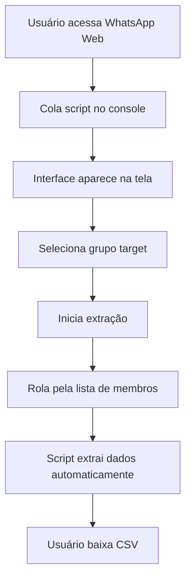

# 🎯 Overview - WhatsApp Group Scraper

## 📋 Índice do Cluster

| Documento | Descrição |
|-----------|-----------|
| [📖 Introdução](./introduction.md) | Propósito, contexto e visão geral |
| [🎯 Objetivos](./objectives.md) | Metas e escopo do projeto |
| [✨ Funcionalidades](./features-summary.md) | Resumo das principais funcionalidades |
| [🏆 Benefícios](./benefits.md) | Vantagens e casos de uso |
| [⚠️ Limitações](./limitations.md) | Restrições e considerações |

## 🚀 Início Rápido

### O que é o WhatsApp Group Scraper?

O **WhatsApp Group Scraper** é uma ferramenta JavaScript que permite extrair informações de membros de grupos do WhatsApp Web de forma automatizada, funcionando diretamente no navegador sem necessidade de instalações adicionais.

### 🎯 Uso Principal

```javascript
// 1. Cole o script no console do WhatsApp Web
// 2. Abra um grupo
// 3. Visualize membros
// 4. Role para extrair dados
// 5. Baixe CSV com informações
```

### ✨ Principais Características

- 🌐 **Browser-based** - Funciona direto no Chrome
- 🚀 **Zero instalação** - Não precisa de extensões
- 📊 **Exportação CSV** - Dados estruturados
- 💾 **Cache local** - Persistência automática
- 🎮 **Interface visual** - Controles intuitivos

### 🔄 Fluxo de Trabalho



### 📈 Status do Projeto

- **Versão Atual**: v1.0.0
- **Status**: ✅ Produção
- **Última Atualização**: Janeiro 2025
- **Compatibilidade**: WhatsApp Web atual
- **Licença**: MIT

---

**Próximos passos**: Explore os documentos específicos deste cluster ou consulte o [Guia de Uso](../features/usage-guide.md) para começar a usar.